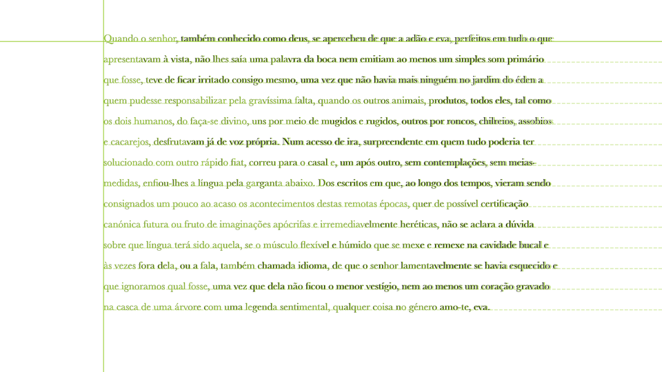
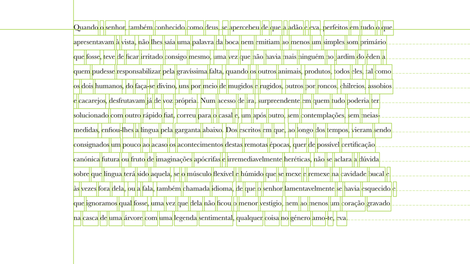

**[If you don't see the images below, this guide, along with full documentation, can also be read here](https://jwcarr.github.io/eyekit/)**

Eyekit is a Python package for analyzing reading behavior using eyetracking data. Eyekit is entirely independent of any particular eyetracker hardware, presentation software, or data formats, and has a minimal set of dependencies. It has an object-oriented style that defines two core objects – the TextBlock and the FixationSequence – that you bring into contact with a bit of coding. Eyekit is currently in the pre-alpha stage and is licensed under the terms of the MIT License.


Is Eyekit the Right Tool for Me?
--------------------------------

- You basically just want to analyze which parts of a text someone is looking at by defining areas of interest.

- You are interested in a fixation-level analysis, as opposed to, for example, saccades or millisecond-by-millisecond eye movements.

- You don't mind doing a little bit of legwork to transform your raw fixation data and texts into something Eyekit can understand.

- You need support for arbitrary fonts that may be monospaced or proportional.

- You want the flexibility to define custom measures and to build your own reproducible processing pipeline.

- You would like tools for dealing with noise and calibration issues, and for discarding fixations according to your own criteria.

- You want to share your data in an open format and produce publication-ready vector graphics.


Installation
------------

The latest version of Eyekit can be installed using `pip`:

```shell
$ pip install eyekit
```

Eyekit is compatible with Python 3.6+ and has two dependencies:

- [NumPy](https://numpy.org)
- [Cairocffi](https://github.com/Kozea/cairocffi)

Cairocffi is a Python wrapper around the graphics library [Cairo](https://cairographics.org), which you will also need to install if you don't already have it. Many Linux distributions have Cairo built in. On a Mac, it can be installed using [Homebrew](https://brew.sh): `brew install cairo`. On Windows, your best bet might be [Anaconda](https://anaconda.org/anaconda/cairo).


Getting Started
---------------

Once installed, import Eyekit in the normal way:

```python
>>> import eyekit
```

Eyekit makes use of two core objects: the `TextBlock` and the `FixationSequence`. Much of Eyekit's functionality involves bringing these two objects into contact. Typically, you define particular areas of the `TextBlock` that are of interest (phrases, words, morphemes, letters...) and check to see which fixations from the `FixationSequence` fall in those areas and for how long.

### The TextBlock object

A `TextBlock` can represent a word, sentence, or passage of text. When you create a `TextBlock` object, it is necessary to specify the pixel position of the top-left corner, the font, and the font size. Let's begin by creating a `TextBlock` representing a single sentence:

```python
>>> sentence = 'The quick brown fox [jump]{stem_1}[ed]{suffix_1} over the lazy dog.'
>>> txt = eyekit.TextBlock(sentence, position=(100, 500), font_face='Times New Roman', font_size=36)
>>> print(txt)
### TextBlock[The quick brown ...]
```

Eyekit has a simple scheme for marking up interest areas, as you can see in the above sentence. Square brackets are used to mark the interest area itself (in this case *jump* and *ed*) and curly braces are used to provide a unique ID for each interest area (in this case `stem_1` and `suffix_1`). These interest areas that have been specifically marked up in the raw text are called "zones". We can iterate over the zones using the `TextBlock.zones()` iterator:

```python
>>> for zone in txt.zones():
>>>     print(zone.id, zone.text, zone.box)
### stem_1 jump (411.923828125, 473.94921875, 74.00390625, 36.0)
### suffix_1 ed (485.927734375, 473.94921875, 33.978515625, 36.0)
```

In this case, we are printing each zone's ID, the string of text it represents, and its bounding box (x, y, width, and height). In addition to manually marked-up zones, you can also create interest areas automatically based on the lines, words, characters, or ngrams of the text. If, for example, you were interested in all words, you could use `TextBlock.words()` to iterate over every word as an interest area without needing to explicitly mark each of them up in the raw text:

```python
>>> for word in txt.words():
>>>     print(word.text, word.box)
### The (95.5, 473.94921875, 64.96875, 36.0)
### quick (160.46875, 473.94921875, 88.98046875, 36.0)
### brown (249.44921875, 473.94921875, 100.986328125, 36.0)
### fox (350.435546875, 473.94921875, 56.98828125, 36.0)
### jumped (407.423828125, 473.94921875, 116.982421875, 36.0)
### over (524.40625, 473.94921875, 72.966796875, 36.0)
### the (597.373046875, 473.94921875, 52.98046875, 36.0)
### lazy (650.353515625, 473.94921875, 68.958984375, 36.0)
### dog (719.3125, 473.94921875, 63.0, 36.0)
```

You can also slice out arbitrary interest areas by using the row and column indices of a section of text. Here, for example, we are taking a slice from row 0 (the first and only line) and characters 10 through 18:

```python
>>> arbitrary_IA = txt[0:10:19]
>>> print(arbitrary_IA.text, arbitrary_IA.box)
### brown fox (253.94921875, 473.94921875, 148.974609375, 36.0)
```

This could be useful if you wanted to slice up the text in some programmatic way, creating interest areas from each three-letter chunk, for example.

### The FixationSequence object

Fixation data is represented in a `FixationSequence` object. Let's create some pretend data to play around with:

```python
>>> seq = eyekit.FixationSequence([[106, 490, 100], [190, 486, 100], [230, 505, 100], [298, 490, 100], [361, 497, 100], [430, 489, 100], [450, 505, 100], [492, 491, 100], [562, 505, 100], [637, 493, 100], [712, 497, 100], [763, 487, 100]])
```

Each fixation is represented by three numbers: its x-coordinate, its y-coordinate, and its duration (in this example, they're all 100ms). Once created, a `FixationSequence` can be traversed, indexed, and sliced as you'd expect. For example,

```python
>>> print(seq[5:10])
### FixationSequence[Fixation[430,489], ..., Fixation[637,493]]
```

slices out fixations 5 through 9 into a new `FixationSequence` object. This could be useful, for example, if you wanted to remove superfluous fixations from the start and end of the sequence.

A basic question we might have at this point is: Do any of these fixations fall inside the zones I marked up? We can write some simple code to answer this:

```python
>>> for fixation in seq:
>>>   for zone in txt.zones():
>>>     if fixation in zone:
>>>       print(f'There was a fixation inside {zone.id}, which is "{zone.text}".')
### There was a fixation inside stem_1, which is "jump".
### There was a fixation inside stem_1, which is "jump".
### There was a fixation inside suffix_1, which is "ed".
```


Visualization
-------------

Now that we've defined a `TextBlock` and `FixationSequence`, it would be useful to visualize how they relate to each other. We begin by creating an `Image` object, specifying the pixel dimensions of the screen:

```python
>>> img = eyekit.vis.Image(1920, 1080)
```

Next we render our text and fixations:

```python
>>> img.draw_text_block(txt)
>>> img.draw_fixation_sequence(seq)
```

Note that the elements of the image will be layered in the order in which these methods are called – in this case, the fixations will be rendered on top of the text. Finally, we save the image (Eyekit supports PDF, EPS, SVG, or PNG):

```python
>>> img.save('quick_brown.pdf')
```


Sometimes it's useful to see the text in the context of the entire screen, as is the case here; other times, we'd like to remove all that excess white space and focus in on the text. To do this, you need to specify a crop margin; the image will then be cropped to the size of the text block plus the specified margin:

```python
>>> img.save('quick_brown_cropped.pdf', crop_margin=1)
```


There are many other options for creating custom visualizations, which you can explore in the `image` module. For example, if you wanted to depict the bounding boxes around the two zoned interest areas we defined earlier, with different colors for stems and suffixes, you might do this:

```python
>>> img = eyekit.vis.Image(1920, 1080)
>>> img.draw_text_block(txt)
>>> for zone in txt.zones():
>>>     if zone.id.startswith('stem'):
>>>         img.draw_rectangle(zone.box, color='crimson')
>>>     elif zone.id.startswith('suffix'):
>>>         img.draw_rectangle(zone.box, color='cadetblue')
>>> img.draw_fixation_sequence(seq)
>>> img.save('quick_brown_with_zones.pdf', crop_margin=1)
```


Colors can be specified as a tuple of RGB values (e.g. `(220, 20, 60)`), a hex triplet (e.g. `#DC143C`), or any [standard HTML color name](https://www.w3schools.com/colors/colors_names.asp) (e.g. `crimson`).


Performing Analyses
-------------------

At the moment, Eyekit has a fairly limited set of analysis functions; in general, you are expected to write code to calculate whatever you are interested in measuring. The functions that are currently available can be explored in the `analysis` module, but two common eyetracking measures that *are* implemented are `analysis.initial_fixation_duration()` and `analysis.total_fixation_duration()`, which may be used like this:

```python
>>> tot_durations = eyekit.analysis.total_fixation_duration(txt.zones(), seq)
>>> print(tot_durations)
### {'stem_1': 200, 'suffix_1': 100}
>>> init_durations = eyekit.analysis.initial_fixation_duration(txt.zones(), seq)
>>> print(init_durations)
### {'stem_1': 100, 'suffix_1': 100}
```

In this case, we see that the total time spent inside the `stem_1` interest area was 200ms, while the duration of the initial fixation on that interest area was 100ms. Similarly, these analysis functions can be applied to other kinds of interest areas, such as words:

```python
>>> tot_durations_on_words = eyekit.analysis.total_fixation_duration(txt.words(), seq)
>>> print(tot_durations_on_words)
### {'0:0:3': 100, '0:4:9': 200, '0:10:15': 100, '0:16:19': 100, '0:20:26': 300, '0:27:31': 100, '0:32:35': 100, '0:36:40': 100, '0:41:44': 100}
```

Here we see that a total of 300ms was spent on the word with ID  `0:20:26`, which is "jumped". Each word ID refers to the unique position that word occupies in the text – in this case, row 0, characters 20 through 25). If you want to perform further operations on a particular interest area, you can slice it out from the text, assign it to a variable, and change its ID to something more useful:

```python
>>> jumped_IA = txt[0:20:26]
>>> jumped_IA.id = 'verb_jumped'
>>> landing_pos = eyekit.analysis.initial_landing_position(jumped_IA, seq)
>>> print(landing_pos)
### {'verb_jumped': 2}
```

The initial fixation on "jumped" landed on character 2.


Multiline Passages
------------------

So far, we've only looked at a single line `TextBlock`, but handling multiline passages works in largely the same way. The principal difference is that when you instantiate your `TextBlock` object, you must pass a *list* of strings (one for each line of text):

```python
>>> txt = eyekit.TextBlock(['This is line 1', 'This is line 2'], position=(100, 500), font_face='Helvetica', font_size=24)
```

To see an example, we'll load in some real multiline passage data from [Pescuma et al.](https://osf.io/hx2sj/) which is included in the [Eyekit GitHub repository](https://github.com/jwcarr/eyekit):

```python
>>> example_data = eyekit.io.read('example/example_data.json')
>>> example_texts = eyekit.io.read('example/example_texts.json')
```

and in particular we'll extract the fixation sequence for trial 0 and its associated text:

```python
>>> seq = example_data['trial_0']['fixations']
>>> pid = example_data['trial_0']['passage_id']
>>> txt = example_texts[pid]['text']
```

As before, we can plot the fixation sequence over the passage of text to see what the data looks like:

```python
>>> img = eyekit.vis.Image(1920, 1080)
>>> img.draw_text_block(txt)
>>> img.draw_rectangle(txt[0:32:40].box, color='orange')
>>> img.draw_rectangle(txt[4:12:17].box, color='orange')
>>> img.draw_fixation_sequence(seq)
>>> img.save('multiline_passage.pdf', crop_margin=4)
```


A common issue with multiline passage reading is that fixations on one line may appear closer to another line due to imperfect eyetracker calibration or general noise. For example, the fixation on "voce" on line two actually falls into the bounding box of the word "vivevano" on line one. Likewise, the fixation on "passeggiata" in the middle of the text is closer to "Mamma" on the line above. Obviously, this noise will cause issues in your analysis further downstream, so it may be useful to first clean up the data by snapping every fixation to its appropriate line. Eyekit implements several drift correction algorithms, which can be applied using the `tools.snap_to_lines()` function from the `tools` module:

```python
>>> original_seq = seq.copy() # Keep a copy of the original sequence
>>> eyekit.tools.snap_to_lines(seq, txt)
```

This process only affects the y-coordinate of each fixation; the x-coordinate is always left unchanged. Various correction methods are available – see the `tools.snap_to_lines()` documentation and [Carr et al. (2020)](https://osf.io/jg3nc/) for a more complete description and evaluation.

To compare the corrected fixation sequence to the original, we'll make two images and then combine them in a single `Figure`:

```python
>>> img1 = eyekit.vis.Image(1920, 1080)
>>> img1.draw_text_block(txt)
>>> img1.draw_fixation_sequence(original_seq)
>>> img1.set_caption('Before correction')
>>> 
>>> img2 = eyekit.vis.Image(1920, 1080)
>>> img2.draw_text_block(txt)
>>> img2.draw_fixation_sequence(seq)
>>> img2.set_caption('After correction')
>>> 
>>> fig = eyekit.vis.Figure(1, 2) # one row, two columns
>>> fig.add_image(img1)
>>> fig.add_image(img2)
>>> fig.set_crop_margin(3)
>>> fig.save('multiline_passage_corrected.pdf')
```


The fixations on "voce" and "passeggiata", for example, are now clearly associated with the correct words, allowing us to proceed with our analysis. It is important to note, however, that drift correction should be applied with care, especially if the fixation data is very noisy or if the passage is being read nonlinearly.

Just as with single-line texts, we can iterate over lines, words, characters, and ngrams using the appropriate methods and apply the same kinds of analysis functions. For example, if we were interested in the word "piccolo"/"piccola" in this passage, we could do this:

```python
>>> img = eyekit.vis.Image(1920, 1080)
>>> img.draw_text_block(txt)
>>> img.draw_fixation_sequence(seq, color='gray')
>>> for word in txt.words('piccol[oa]'):
>>>   tot_dur = eyekit.analysis.total_fixation_duration(word, seq)
>>>   img.draw_rectangle(word.box, color='lightseagreen')
>>>   img.draw_annotation(word.x_tl+2, word.y_br-3, f'{tot_dur[word.id]}ms', color='lightseagreen', font_face='Arial bold', font_size=4)
>>> img.save('multiline_passage_piccol.pdf', crop_margin=4)
```


Input–Output
------------

Eyekit is not especially committed to any particular file format; so long as you have an x-coordinate, a y-coordinate, and a duration for each fixation, you are free to store data in whatever format you choose. However, as we have seen briefly above, Eyekit provides built-in support for JSON, where a typical data file might look something like this:

```json
{
  "trial_0" : {
    "participant_id": "John",
    "passage_id": "passage_a",
    "fixations": { "__FixationSequence__" : [[412, 142, 131], ..., [588, 866, 224]] }
  },
  "trial_1" : {
    "participant_id": "Mary",
    "passage_id": "passage_b",
    "fixations": { "__FixationSequence__" : [[368, 146, 191], ..., [725, 681, 930]] }
  },
  "trial_2" : {
    "participant_id": "Jack",
    "passage_id": "passage_c",
    "fixations": { "__FixationSequence__" : [[374, 147, 277], ..., [1288, 804, 141]] }
  }
}
```

This format is open, human-readable, and flexible. With the exception of the `__FixationSequence__` object, you can freely store whatever key-value pairs you want and you can organize the hierarchy of the data structure in any way that makes sense for your project. JSON files can be loaded using the `io.read()` function from the `io` module:

```python
>>> data = eyekit.io.read('example/example_data.json')
>>> print(data)
### {'trial_0': {'participant_id': 'John', 'passage_id': 'passage_a', 'fixations': FixationSequence[Fixation[412,142], ..., Fixation[588,866]]}, 'trial_1': {'participant_id': 'Mary', 'passage_id': 'passage_b', 'fixations': FixationSequence[Fixation[368,146], ..., Fixation[725,681]]}, 'trial_2': {'participant_id': 'Jack', 'passage_id': 'passage_c', 'fixations': FixationSequence[Fixation[374,147], ..., Fixation[1288,804]]}}
```

which automatically instantiates any `FixationSequence` objects. Similarly, an arbitrary dictionary of data can be written out using the `io.write()` function:

```python
>>> eyekit.io.write(data, 'output_data.json', compress=True)
```

If `compress` is set to `True` (the default), files are written in the most compact way; if `False`, the file will be larger but more human-readable (like the example above). JSON can also be used to store `TextBlock` objects – see `example_texts.json` for an example – and you can even store `FixationSequence` and `TextBlock` objects in the same file if you like to keep things organized together.


Getting Data into Eyekit
------------------------

Currently, the options for converting your raw data into something Eyekit can understand are quite limited. In time, I hope to add more functions that convert from common formats.

### Fixation data

If you have your fixation data in CSV files, you could load the data into a `FixationSequence` by doing something along these lines (assuming you have columns `x`, `y`, and `duration`):

```python
>>> import pandas
>>> data = pandas.read_csv('mydata.csv')
>>> fixations = [fxn for fxn in zip(data['x'], data['y'], data['duration'])]
>>> seq = eyekit.FixationSequence(fixations)
```

Eyekit has rudimentary support for importing data from ASC files. When importing data this way, you must specify the name of a trial variable and its possible values so that the importer can determine when a new trial begins:

```python
>>> data = eyekit.io.import_asc('mydata.asc', 'trial_type', ['Experimental'], extract_vars=['passage_id', 'response'])
```

In this case, when parsing the ASC file, the importer would consider

```plaintext
MSG 4244100 !V TRIAL_VAR trial_type Experimental
```

to mark the beginning of a new trial and will extract all `EFIX` lines that occur within the subsequent `START`–`END` block. Optionally, you can specify other variables that you want to extract (in this case `passage_id` and `response`), resulting in imported data that looks like this:

```python
{
  "trial_0" : {
    "trial_type" : "Experimental",
    "passage_id" : "passage_a",
    "response" : "yes",
    "fixations" : FixationSequence[[368, 161, 208], ..., [562, 924, 115]]
  }
}
```

In addition, rather than load one ASC file at a time, you can also point to a directory of ASC files, all of which will then be loaded into a single dataset:

```python
>>> data = eyekit.io.import_asc('asc_data_files/', 'trial_type', ['Experimental'], extract_variables=['passage_id', 'response'])
```

which could then be written out to Eyekit's native format for quick access in the future:

```python
>>> eyekit.io.write(data, 'converted_asc_data.json')
```

### Text data

Getting texts into Eyekit can be a little tricky because their precise layout will be highly dependent on many different factors – not just the font and its size, but also the peculiarities of the presentation software and its text rendering engine.

Ideally, all of your texts will be presented so that the top-left corner of the block of text is located in a consistent position on the screen (depending on how you set up your experiment, this may already be the case). Eyekit uses this position to estimate the location of every character in the text based on the particular font and font size you are using. This process is somewhat imperfect, however, especially if you are using a proportional font that makes use of advanced typographical features such as kerning and ligatures, as is the case below.

The best way to check that the `TextBlock` is set up correctly is to pass it to `tools.align_to_screenshot()` from the `eyekit.tools` module, along with the path to a screenshot of the text as displayed to the participant:

```python
>>> txt = eyekit.TextBlock(saramago_text, position=(300, 100), font_face='Baskerville', font_size=30, line_height=60)
>>> eyekit.tools.align_to_screenshot(txt, 'screenshot.png')
```


This will create a new file `'screenshot_eyekit.png'`. In this file, Eyekit's rendering of the text is presented in green overlaying the original screenshot image. The point where the two solid green lines intersect is the `TextBlock`'s `position` argument, and the dashed green lines show the baselines of each subsequent line, which is based on the `line_height` argument. You can use this output to adjust the parameters of the `TextBlock` accordingly. Alternatively, instead of overlaying the text, you can overlay the word bounding boxes that Eyekit has identified to check how reliable they are:

```python
>>> eyekit.tools.align_to_screenshot(txt, 'screenshot.png', show_text=False, show_bounding_boxes=True)
```


As you can see, although the identified bounding boxes are imperfect in some cases, they are certainly good enough for a word-level analysis.


Contributing
------------

Eyekit is still in an early stage of development, but I am very happy to receive bug reports and suggestions via the [GitHub Issues page](https://github.com/jwcarr/eyekit/issues). If you'd like to work on new features or fix stuff that's currently broken, please feel free to fork the repo and/or raise an issue to discuss details. Before sending a pull request, you should check that the unit tests pass using [Pytest](https://pytest.org):

```shell
$ pytest tests/
```

and run [Black](https://black.readthedocs.io) over the codebase to normalize the style:

```shell
$ black eyekit/
```
