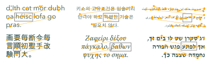
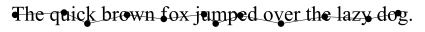
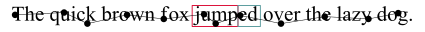
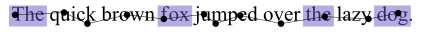
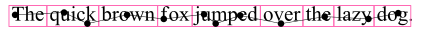
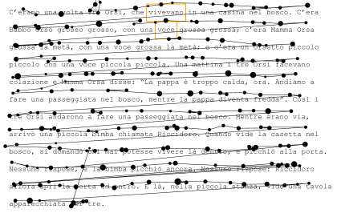
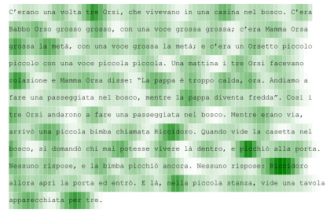

Eyekit is a Python package for analyzing reading behavior using eyetracking data. Eyekit aims to be entirely independent of any particular eyetracker hardware, experiment software, or data formats. It has an object-oriented style that defines three core objects – the TextBlock, InterestArea, and FixationSequence – that you bring into contact with a bit of coding.




Is Eyekit the Right Tool for Me?
--------------------------------

- You want to analyze which parts of a text someone is looking at and for how long.

- You need convenient tools for extracting areas of interest from texts, such as specific words, phrases, or letter combinations.

- You want to calculate common reading measures, such as gaze duration or initial landing position.

- You need support for arbitrary fonts, multiline passages, right-to-left text, or non-alphabetical scripts.

- You want the flexibility to define custom reading measures and to build your own reproducible processing pipeline.

- You would like tools for dealing with noise and calibration issues, and for discarding fixations according to your own criteria.

- You want to share your data in an open format and produce publication-ready vector graphics.


Installation
------------

Eyekit may be installed using `pip`:

```shell
pip install eyekit
```

Eyekit is compatible with Python 3.8+. Its main dependency is the graphics library [Cairo](https://cairographics.org), which you might also need to install if it's not already on your system. Many Linux distributions have Cairo built in. On a Mac, it can be installed using [Homebrew](https://brew.sh): `brew install cairo`. On Windows, it can be installed using [Anaconda](https://anaconda.org/anaconda/cairo): `conda install -c anaconda cairo`.


Getting Started
---------------

Once installed, import Eyekit in the normal way:

```python
import eyekit
```

Eyekit makes use of three core objects: the `FixationSequence`, `TextBlock`, and `InterestArea`. Much of Eyekit's functionality involves bringing these objects into contact. Typically, you define particular areas of the `TextBlock` that are of interest (phrases, words, morphemes, letters...) and check to see which fixations from the `FixationSequence` fall in those `InterestArea`s and for how long.

### The FixationSequence object

Fixation data is represented in a `FixationSequence`. Usually you will import fixation data from some raw data files, but for now let's just create some pretend data to play around with:

```python
seq = eyekit.FixationSequence([[106, 490, 0, 100], [190, 486, 100, 200], [230, 505, 200, 300], [298, 490, 300, 400], [361, 497, 400, 500], [430, 489, 500, 600], [450, 505, 600, 700], [492, 491, 700, 800], [562, 505, 800, 900], [637, 493, 900, 1000], [712, 497, 1000, 1100], [763, 487, 1100, 1200]])
```

At a minimum, each fixation is represented by four numbers: its x-coordinate, its y-coordinate, its start time, and its end time (so, in this example, they all last 100ms). Once created, a `FixationSequence` can be traversed, indexed, and sliced just like an ordinary `list`. For example,

```python
print(seq[5:10])
# FixationSequence[Fixation[430,489], ..., Fixation[637,493]]
```

slices out fixations 5 through 9 into a new `FixationSequence` object. A `FixationSequence` (and the `Fixation` objects it contains) has various properties that you can query:

```python
print(len(seq)) # Number of fixations
# 12
print(seq.duration) # Duration of whole sequence
# 1200
print(seq[0].duration) # Duration of first fixation
# 100
print(seq[-1].xy) # xy coordinates of final fixation
# (763, 487)
print(seq[1].x) # x coordinate of second fixation
# 190
```

### The TextBlock object

A `TextBlock` can represent a word, sentence, or passage of text. When you create a `TextBlock` object, it is necessary to specify various details such as its position on the screen and the font:

```python
sentence = 'The quick brown fox [jump]{stem}[ed]{suffix} over the lazy dog.'
txt = eyekit.TextBlock(sentence, position=(100, 500), font_face='Times New Roman', font_size=36)
print(txt)
# TextBlock[The quick brown f...]
```

Eyekit has a simple scheme for marking up interest areas, as you can see in the above sentence. Square brackets are used to mark the interest area itself (in this case *jump* and *ed*) and curly braces are used to provide a unique ID for each interest area (in this case `stem` and `suffix`). We can extract a particular interest area by using its ID:

```python
print(txt['stem'])
# InterestArea[stem, jump]
```

Manually marking up interest areas in the raw text is typically useful if you have a small number of known interest areas. However, Eyekit also provides more powerful tools for extracting interest areas programmatically. For example, you can use `TextBlock.words()` to iterate over every word in the text as an `InterestArea` without needing to explicitly mark each of them up in the raw text:

```python
for word in txt.words():
  print(word)
# InterestArea[0:0:3, The]
# InterestArea[0:4:9, quick]
# InterestArea[0:10:15, brown]
# InterestArea[0:16:19, fox]
# InterestArea[0:20:26, jumped]
# InterestArea[0:27:31, over]
# InterestArea[0:32:35, the]
# InterestArea[0:36:40, lazy]
# InterestArea[0:41:44, dog]
```

You can also supply a regular expression to iterate over words that match a certain pattern; words that end in *ed* for example:

```python
for word in txt.words('.+ed'):
  print(word)
# InterestArea[0:20:26, jumped]
```

or just the four-letter words:

```python
for word in txt.words('.{4}'):
  print(word)
# InterestArea[0:27:31, over]
# InterestArea[0:36:40, lazy]
```

or case-insensitive occurrences of the word *the*:

```python
for word in txt.words('(?i)the'):
  print(word)
# InterestArea[0:0:3, The]
# InterestArea[0:32:35, the]
```

You can collate a bunch of interest areas into a list for convenient access later on. For example, if you wanted to do some analysis on all the three-letter words, you might extract them and assign them to a variable like so:

```python
three_letter_words = list(txt.words('.{3}'))
print(three_letter_words)
# [InterestArea[0:0:3, The], InterestArea[0:16:19, fox], InterestArea[0:32:35, the], InterestArea[0:41:44, dog]]
```

You can also slice out arbitrary interest areas by using the row and column indices of a section of text. Here, for example, we are extracting a two-word section of text from line 0 (the first and only line) and characters 10 through 18:

```python
brown_fox_ia = txt[0:10:19]
print(brown_fox_ia)
# InterestArea[0:10:19, brown fox]
```

### The InterestArea object

Once you've extracted an `InterestArea`, you can access various properties about it:

```python
print(brown_fox_ia.text) # get the string represented in this IA
# brown fox
print(brown_fox_ia.width) # get the pixel width of this IA
# 160.2421875
print(brown_fox_ia.center) # get the xy coordinates of the center of the IA
# (329.5703125, 491.94921875)
print(brown_fox_ia.onset) # get the x coordinate of the IA onset
# 253.94921875
print(brown_fox_ia.location) # get the location of the IA in its parent TextBlock
# (0, 10, 19)
print(brown_fox_ia.id) # get the ID of the IA
# 0:10:19
```

By default, an `InterestArea` will have an ID of the form `0:10:19`, which refers to the unique position that it occupies in the text. However, you can also change the IDs to something more descriptive, if you wish. For example, you could enumerate the words in the text and give each one a number:

```python
for i, word in enumerate(txt.words()):
  word.id = f'word{i}'
```

and, since `InterestArea`s are passed around by reference, the IDs will update everywhere. For example, it we print the `three_letter_words` list we created earlier, we find that it now reflects the new IDs:

```python
print(three_letter_words)
# [InterestArea[word0, The], InterestArea[word3, fox], InterestArea[word6, the], InterestArea[word8, dog]]
```

The `InterestArea` defines the `in` operator in a special way so that you can conveniently check if a fixation falls inside its bounding box. For example:

```python
for fixation in seq:
  if fixation in brown_fox_ia:
    print(fixation)
# Fixation[298,490]
# Fixation[361,497]
```

An `InterestArea` can be any sequence of consecutive characters, and, as you can see, it's possible to define several overlapping `InterestArea`s at the same time: `txt['word4']` (*jumped*), `txt['stem']` (*jump*), `txt['suffix']` (*ed*), and `txt[0:24:25]` (the *p* in *jumped*) can all coexist.


Visualization
-------------

Now that we've created a `FixationSequence` and `TextBlock`, and we've extracted some `InterestArea`s, it would be useful to visualize how these things relate to each other. To create a visualization, we begin by creating an `Image` object, specifying the pixel dimensions of the screen:

```python
img = eyekit.vis.Image(1920, 1080)
```

Next we render our text and fixations onto this image:

```python
img.draw_text_block(txt)
img.draw_fixation_sequence(seq)
```

Note that the elements of the image will be layered in the order in which these methods are called – in this case, the fixations will be rendered on top of the text. Finally, we save the image (Eyekit supports PDF, EPS, SVG, or PNG):

```python
img.save('quick_brown.svg')
```


Sometimes it's useful to see the text in the context of the entire screen, as is the case here; other times, we'd like to remove all that excess white space and focus in on the text. To do this, you need to specify a crop margin; the image will then be cropped to the size of the text block plus the specified margin:

```python
img.save('quick_brown_cropped.svg', crop_margin=2)
```


There are many other options for creating custom visualizations, which you can explore in the `vis` module. For example, if you wanted to depict the bounding boxes around the two interest areas we manually marked-up in the raw text, you might do this:

```python
img = eyekit.vis.Image(1920, 1080)
img.draw_text_block(txt)
img.draw_rectangle(txt['stem'], color='crimson')
img.draw_rectangle(txt['suffix'], color='cadetblue')
img.draw_fixation_sequence(seq)
img.save('quick_brown_with_zones.svg', crop_margin=2)
```


Colors can be specified as a tuple of RGB values (e.g. `(220, 20, 60)`), a hex triplet (e.g. `#DC143C`), or any [standard HTML color name](https://www.w3schools.com/colors/colors_names.asp) (e.g. `crimson`). Similarly, we can do the same thing with the list of three-letter words we created earlier:

```python
img = eyekit.vis.Image(1920, 1080)
img.draw_text_block(txt)
for word in three_letter_words:
  img.draw_rectangle(word, fill_color='slateblue', opacity=0.5)
img.draw_fixation_sequence(seq)
img.save('quick_brown_with_3letter_words.svg', crop_margin=2)
```


Or, indeed, all words in the text:

```python
img = eyekit.vis.Image(1920, 1080)
img.draw_text_block(txt)
for word in txt.words():
  img.draw_rectangle(word, color='hotpink')
img.draw_fixation_sequence(seq)
img.save('quick_brown_with_all_words.svg', crop_margin=2)
```


Note that, by default, each `InterestArea`'s bounding box is slightly padded by, at most, half of the width of a space character. This ensures that, even if a fixation falls between two words, it will still be assigned to one of them. Padding is only applied to an `InterestArea`'s edge if that edge adjoins a non-alphabetical character (i.e. spaces and punctuation). Thus, when *jumped* was divided into separate stem and suffix areas above, no padding was applied word-internally. If desired, automatic padding can be turned off by setting the `autopad` argument to `False` during the creation of the `TextBlock`, or it can be controlled manually using the `InterestArea.adjust_padding()` method.


Taking Measurements
-------------------

The `measure` module provides various functions for computing common reading measures, including, for example:

- `measure.gaze_duration`
- `measure.initial_fixation_duration`
- `measure.initial_landing_position`

These functions take an `InterestArea` and `FixationSequence` as input, and return the measure of interest. For example, if we wanted to measure the initial landing position on the `stem` interest area, we can apply the function like this:

```python
print(eyekit.measure.initial_landing_position(txt['stem'], seq))
# 2
```

The initial fixation on *jump* landed on character 2. You can also apply these functions to a collection of interest areas. This will return a dictionary of results in which the keys are the `InterestArea` IDs. For example, if we wanted to calculate the initial fixation duration on the three-letter words we extracted earlier, we can do this:

```python
print(eyekit.measure.initial_fixation_duration(three_letter_words, seq))
# {'word0': 100, 'word3': 100, 'word6': 100, 'word8': 100}
```

In this case, we see that the initial fixation on each of the three-letter words lasted 100ms.

Typically, you will want to apply multiple measures to several interest areas across many trials, generating what is sometimes known as an "interest area report." The `eyekit.measure.interest_area_report()` function can help you do this, outputting a Pandas dataframe that can then be used in your downstream statistical analyses. `eyekit.measure.interest_area_report()` expects a list of trials and a list of measurement functions. Each trial should be a dictionary containing at least two keys: `fixations`, which will map to a `eyekit.fixation.FixationSequence`, and `interest_areas`, which will map to a list of interest areas extracted from a `eyekit.text.TextBlock`. Any other keys in the dictionary (e.g., subject or trial identifiers) will be included as separate columns in the resulting dataframe. For example, here we are creating an interest area report (for all words) using the dummy data created above:

```python
trials = [
  {
    'trial_id': 'dummy_trial',
    'fixations': seq,
    'interest_areas': txt.words(),
  }
]
df = eyekit.measure.interest_area_report(trials, measures=['gaze_duration', 'total_fixation_duration'])
print(df) #skiptest
#       trial_id interest_area_id interest_area_text  initial_fixation_duration  total_fixation_duration #skiptest
# 0  dummy_trial            0:0:3                The                        100                      100 #skiptest
# 1  dummy_trial            0:4:9              quick                        100                      200 #skiptest
# 2  dummy_trial          0:10:15              brown                        100                      100 #skiptest
# 3  dummy_trial          0:16:19                fox                        100                      100 #skiptest
# 4  dummy_trial          0:20:26             jumped                        100                      300 #skiptest
# 5  dummy_trial          0:27:31               over                        100                      100 #skiptest
# 6  dummy_trial          0:32:35                the                        100                      100 #skiptest
# 7  dummy_trial          0:36:40               lazy                        100                      100 #skiptest
# 8  dummy_trial          0:41:44                dog                        100                      100 #skiptest
```

Since this outputs a Pandas dataframe, you can interact with the data using standard Pandas methods, including, for example, saving the dataframe to a CSV file:

```python
df.to_csv('path/to/results.csv') #skiptest
```

The measurement functions provided by Eyekit can be used as-is or you can take a look at the underlying code and adapt them for your own purposes. For example, say – for some reason – you wanted to measure total fixation duration but double the duration if the word begins with a vowel, you could define your own custom measurement function like so:

```python
def my_special_measure(interest_area, fixation_sequence):
  total_duration = 0
  for fixation in fixation_sequence:
    if fixation in interest_area:
      if interest_area.text.startswith(('a', 'e', 'i', 'o', 'u')):
        total_duration += fixation.duration * 2
      else:
        total_duration += fixation.duration
  return total_duration
```

and then apply your function to some data:

```python
print(my_special_measure(txt['suffix'], seq))
# 200
```


Multiline Passages
------------------

So far, we've only looked at a single line `TextBlock`, but handling multiline passages works in largely the same way. The principal difference is that when you instantiate your `TextBlock` object, you must pass a *list* of strings (one for each line of text):

```python
txt = eyekit.TextBlock(['This is line 1', 'This is line 2'], position=(100, 500), font_face='Helvetica', font_size=24)
```

To see an example, we'll load in some real multiline passage data from [Pescuma et al.](https://osf.io/hx2sj/) which is included in the [Eyekit GitHub repository](https://github.com/jwcarr/eyekit):

```python
example_data = eyekit.io.load('example/example_data.json')
example_texts = eyekit.io.load('example/example_texts.json')
```

and in particular we'll extract the fixation sequence for trial 0 and its associated text:

```python
seq = example_data['trial_0']['fixations']
pid = example_data['trial_0']['passage_id']
txt = example_texts[pid]['text']
```

As before, we can plot the fixation sequence over the passage of text to see what the data looks like:

```python
img = eyekit.vis.Image(1920, 1080)
img.draw_text_block(txt)
img.draw_rectangle(txt[0:32:40], color='orange')
img.draw_rectangle(txt[1:34:38], color='orange')
img.draw_fixation_sequence(seq)
img.save('multiline_passage.svg', crop_margin=4)
```


First, we might decide that we want to discard that final fixation, where the participant jumped a few lines up right at the end:

```python
seq[-1].discard() # discard the final fixation
```

A second problem we can see here is that fixations on one line sometimes appear slightly closer to another line due to imperfect eyetracker calibration. For example, the fixation on the word *voce* on line two actually falls into the bounding box of the word *vivevano* on line one. Obviously, this will cause issues in your analysis further downstream, so it can be useful to first clean up the data by snapping every fixation to its appropriate line. Eyekit implements several different line assignment algorithms, which can be applied using the `FixationSequence.snap_to_lines()` method:

```python
original_seq = seq.copy() # keep a copy of the original sequence
seq.snap_to_lines(txt)
```

This process adjusts the y-coordinate of each fixation so that it matches the midline of its assigned line. To compare the corrected fixation sequence to the original, we could make two images and then combine them in a single `Figure`, like so:

```python
img1 = eyekit.vis.Image(1920, 1080)
img1.draw_text_block(txt)
img1.draw_rectangle(txt[0:32:40], color='orange')
img1.draw_rectangle(txt[1:34:38], color='orange')
img1.draw_fixation_sequence(original_seq)
img1.set_caption('Before correction')

img2 = eyekit.vis.Image(1920, 1080)
img2.draw_text_block(txt)
img2.draw_rectangle(txt[0:32:40], color='orange')
img2.draw_rectangle(txt[1:34:38], color='orange')
img2.draw_fixation_sequence(seq)
img2.set_caption('After correction')

fig = eyekit.vis.Figure(1, 2) # one row, two columns
fig.add_image(img1)
fig.add_image(img2)
fig.set_crop_margin(3)
fig.save('multiline_passage_corrected.svg')
```


The fixation on *voce* is now clearly associated with the correct word. Nevertheless, `snap_to_lines()` should be applied with care, especially if the fixation data is very noisy or if the passage is being read nonlinearly. For advice on which method to use, see [Carr et al. (2021)](https://doi.org/10.3758/s13428-021-01554-0).

Just like single-line texts, we can extract interest areas from the passage and take measurements in the same way. For example, if we were interested in the word *piccolo*/*piccola* in this passage, we could extract all occurrences of this word and calculate the total fixation duration:

```python
piccol_words = list(txt.words('piccol[oa]'))
durations = eyekit.measure.total_fixation_duration(piccol_words, seq)
print(durations)
# {'2:64:71': 253, '3:0:7': 347, '3:21:28': 246, '3:29:36': 319, '7:11:18': 268, '10:43:50': 178}
```

Furthermore, we could make a visualization to show this information:

```python
img = eyekit.vis.Image(1920, 1080)
img.draw_text_block(txt)
for word in piccol_words:
  img.draw_rectangle(word, color='lightseagreen')
  x = word.onset
  y = word.y_br - 3
  label = f'{durations[word.id]}ms'
  img.draw_annotation((x, y), label, color='lightseagreen', font_face='Arial bold', font_size=4)
img.draw_fixation_sequence(seq, color='gray')
img.save('multiline_passage_piccol.svg', crop_margin=4)
```


Another way to look at the data is to distribute the fixations across the characters of the passage probabilistically, under the assumption that the closer a character is to a fixation point, the more likely it is that the reader is perceiving that character. This can be performed with the `measure.duration_mass` function and plotted in a heatmap like so:

```python
mass = eyekit.measure.duration_mass(txt, seq)
img = eyekit.vis.Image(1920, 1080)
img.draw_heatmap(txt, mass, color='green')
img.save('multiline_passage_mass.svg', crop_margin=4)
```



Input–Output
------------

Eyekit is not especially committed to any particular file format; so long as you have an x-coordinate, a y-coordinate, a start time, and an end time for each fixation, you are free to store data in whatever format you choose. However, as we have seen briefly above, Eyekit provides built-in support for JSON, where a typical data file might look something like this:

```json
{
  "trial_0" : {
    "participant_id": "John",
    "passage_id": "passage_a",
    "fixations": {
      "__FixationSequence__": [
        {
          "x": 412,
          "y": 142,
          "start": 770,
          "end": 900
        },
        {
          "x": 459,
          "y": 163,
          "start": 924,
          "end": 1035
        },
        {
          "x": 551,
          "y": 160,
          "start": 1062,
          "end": 1395
        }
      ]
    }
  },
  "trial_1" : {
    "participant_id": "Mary",
    "passage_id": "passage_b",
    "fixations": {
      "__FixationSequence__": [
        {
          "x": 368,
          "y": 146,
          "start": 7,
          "end": 197
        },
        {
          "x": 431,
          "y": 154,
          "start": 415,
          "end": 660
        },
        {
          "x": 512,
          "y": 150,
          "start": 685,
          "end": 876
        }
      ]
    }
  }
}
```

This format is compact, structured, human-readable, and flexible. With the exception of the `__FixationSequence__` object, you can freely store whatever key-value pairs you want and you can organize the hierarchy of the data structure in any way that makes sense for your project. JSON files can be loaded using the `io.load()` function from the `io` module:

```python
data = eyekit.io.load('example/example_data.json')
```

which automatically instantiates any `FixationSequence` objects. Similarly, an arbitrary dictionary or list can be written out using the `io.save()` function:

```python
eyekit.io.save(data, 'output_data.json', compress=True) #skiptest
```

If `compress` is set to `True`, files are written in the most compact way; if `False`, the file will be larger but more human-readable (like the example above). JSON can also be used to store `TextBlock` objects – see `example_texts.json` for an example – and you can even store `FixationSequence` and `TextBlock` objects in the same file if you like to keep things organized together.

The `io` module also provides functions for importing data from other formats: `io.import_asc()` and `io.import_csv()`. Once data has been imported this way, it may then be written out to Eyekit's native JSON format for quick access in the future. In time, I hope to add more functions to import data from common eyetracker formats.


Creating Experimental Stimuli
-----------------------------

Eyekit is primarily intended for use at the analysis stage. However, it is possible to create basic experimental stimuli that can be presented in software of your choice. This can be achieved with the `tools.create_stimuli()` function. For example, you can specify a path to some .txt files, along with an output path and various details about the presentation of the texts:

```python
eyekit.tools.create_stimuli( #skiptest
  'path/to/my/raw/texts/', #skiptest
  'path/to/save/my/stimuli/', #skiptest
  screen_width=1920, #skiptest
  screen_height=1080, #skiptest
  position=(400, 200), #skiptest
  font_face='Consolas', #skiptest
  font_size=20, #skiptest
  line_height=40, #skiptest
  color='black', #skiptest
  background_color='white', #skiptest
) #skiptest
```

This will output a PNG image for each text file, plus a file called `stimuli.json` that contains each text as a `TextBlock` object (for use at the analysis stage). The PNG images may then be presented at full size on the experimental computer (e.g. 1920×1080).


Getting Texts into Eyekit
-------------------------

For more complex experimental designs or if you used other software to create your stimuli, you will need to recreate the stimuli as Eyekit `TextBlock`s based on what you know about how they were presented. This can be a little tricky because the precise layout of the texts will be dependent on many different factors – not just the font and its size, but also the peculiarities of the experiment software and its text rendering engine.

Ideally, all of your texts will have been presented in some consistent way. For example, they might be centralized on the screen or they might have a consistent left edge. The best way to check that a `TextBlock` is set up correctly is to check it against a screenshot from your actual experiment. Eyekit provides the `tools.align_to_screenshot()` tool to help you do this. First, set up your text block with parameters that you think are correct:

```python
txt = eyekit.TextBlock( #skiptest
  saramago_text, #skiptest
  position=(300, 100), #skiptest
  font_face='Baskerville', #skiptest
  font_size=30, #skiptest
  line_height=60, #skiptest
  align='left', #skiptest
  anchor='left' #skiptest
) #skiptest
```

Then pass it to the `tools.align_to_screenshot()` function along with the path to a PNG screenshot file:

```python
eyekit.tools.align_to_screenshot(txt, 'screenshot.png') #skiptest
```


This will create a new image file ending `_eyekit.png` (e.g. `screenshot_eyekit.png`). In this file, Eyekit's rendering of the text is presented in green overlaying the original screenshot image. The point where the two solid green lines intersect corresponds to the `TextBlock`'s `position` argument, and the dashed green lines show the baselines of subsequent lines of text, which is based on the `line_height` argument. You can use this output image to adjust the parameters of the `TextBlock` accordingly. In this example case, we see that the `TextBlock` is positioned slightly too high up. If all of your texts are presented in a consistent way, you should only need to establish these parameters once.


Multilingual Support
--------------------

Eyekit aims to offer good multilingual support, and the most common scripts – Arabic, Chinese, Cyrillic, Greek, Hebrew, Japanese, Korean, Latin – should all work out of the box. Right-to-left text (and bidirectional text in general) is supported – all you need to do is set `right_to_left=True` when creating a `TextBlock`. This ensures that the text will be rendered correctly and that functions like `measure.initial_landing_position` and `FixationSequence.snap_to_lines` will process the text in right-to-left direction. If you are working with the Arabic script, the text should be shaped prior to passing it into Eyekit using, for example, the [Arabic-reshaper](https://github.com/mpcabd/python-arabic-reshaper) package.

Eyekit uses Cairo's "toy font" API to extract character metrics from the fonts available on your system. This API can be somewhat imperfect, especially if you are working with a particularly complex script or advanced typographical features, such as ligatures and kerning. However, in most cases it should be more than sufficient to extract areas of interest fairly accurately. When choosing a font for your experiment, the key thing to do is to make sure it supports all the glyphs in the language you're working with (some software, for example, may fall back to an alternative font in cases where a glyph is missing).


Contributing
------------

Eyekit is still in an early stage of development, but I am very happy to receive bug reports and suggestions via the [GitHub Issues page](https://github.com/jwcarr/eyekit/issues). If you'd like to work on new features or fix stuff that's currently broken, please feel free to fork the repo and/or raise an issue to discuss details. Before sending a pull request, you should check that the unit tests pass using [Pytest](https://pytest.org):

```shell
pytest tests/
```

and run [Black](https://black.readthedocs.io) over the codebase to normalize the style:

```shell
black eyekit/
```

Here are some areas of Eyekit that are currently underdeveloped:

- Additional reading measures (e.g. of saccades and regressions)
- Awareness of different experimental paradigms
- Creation of animations/videos
- More convenient methods for collating results into dataframes etc.
- Importing data from other eyetracker data formats
- Synchronization of fixation data with other types of experimental event
- Support for nontextual objects, such as images or shapes
- Interactive tools for cleaning up raw data
- General testing and the addition of more unit tests
