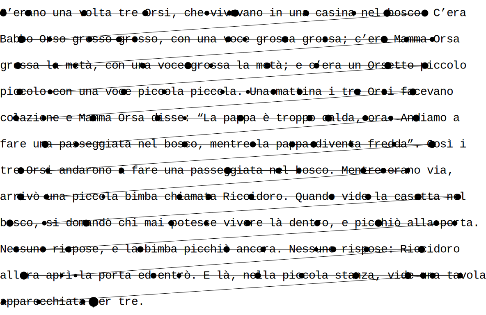

Eyekit
======

Eyekit is a Python package for handling and visualizing eyetracking data, with a particular emphasis on the reading of multiline passages presented in a fixed-width font.


Python dependencies
-------------------

Eyekit requires Python 3.6 or greater and the following packages:

- numpy 1.13
- cairosvg 2.4


Installation
------------

Eyekit is not currently listed in PyPI, but the latest verison can be installed directly from this GitHub repo using `pip`:

```
pip install https://github.com/jwcarr/eyekit/archive/master.tar.gz
```


Getting started
---------------

Once installed, import Eyekit into your project in the normal way:

```python
import eyekit
```

Eyekit makes use of two basic types of object: the `Passage` object and the `FixationSequence` object. Much of Eyekit's functionality centers around bringing these two objects into contact; typically, we have a passage of text and we want to analyze which parts of the passage the participant is looking at.

### The `Passage` object

A `Passage` object represents the passage of text. It can be created by referencing a .txt file or by passing in a list of strings (one string for each line of text). When you initialize the `Passasge`, it is necessary to specify the pixel position of the first character, the pixel spacing between characters, and the pixel spacing between lines – this allows Eyekit to establish the position of every character:

```python
passage = eyekit.Passage('example_passage.txt',
	first_character_position=(368, 155),
	character_spacing=16,
	line_spacing=64
)
```

If necessary, passages can be marked up with interest areas using the following bracketing scheme:

```
The quick brown fox [jump]{stem_1}[ed]{suffix_1} over the lazy dog.
```

Square brackets mark the interest areas (in this case *jump* and *ed*) and curly braces provide a unique label for each interest area (in this case `stem_1` and `suffix_1`). Interest areas can then be iterated over using the `iter_IAs()` method:

```python
for interest_area in passage.iter_IAs():
	print(interest_area.label, interest_area.text)
```

```python
stem_1 jump
suffix_1 ed
```

### The `FixationSequence` object

Eyekit is not especially committed to one particular file format; so long as you have an x-coordinate, a y-coordinate, and a duration for each fixation, you are free to store data in whatever format you choose. However, Eyekit does provide built-in support for a standardized JSON-based format, where a typical data file looks like this:

```json
{
  "header" : "My Experiment",
  "trials" : {
    "trial_1" : {
      "participant_id" : "Jon",
      "passage_id" : "A",
      "fixations" : [[368, 161, 208], [428, 160, 178], [565, 151, 175], ..., [562, 924, 115]]
    }
  }
}
```

This format is open, human-readable, and fairly flexible. At a minimum there must be a top-level key called `trials`, which maps to an object, and each trial within that object must contain a key called `fixations`, which maps to an array containing x, y, and duration for each fixation. Aside from this, you can freely add other key–value pairs (e.g., participant IDs, trial IDs, etc.). These data files can be loaded using the `read()` function from the `io` module:

```python
eyekit.io.read('example_data.json')
```

Alternatively, if you have your data in some other format, you can create a fixation sequence manually by doing something like this:

```python
fixation_sequence = eyekit.FixationSequence([[368, 161, 208], [428, 160, 178], [565, 151, 175], ..., [562, 924, 115]])
```

`FixationSequence`s can be traversed, indexed, and sliced as you'd expect. For example,

```python
print(fixation_sequence[10:15])
```

slices out fixations 10 through 14 into a new `FixationSequence`:

```python
FixationSequence[Fixation[1394,187], ..., Fixation[688,232]]
```


### Bringing a `FixationSequence` into contact with a `Passage`

The `Passage` object provides three methods for finding the nearest character, word, or ngram to a given fixation: nearest_word(), nearest_char(), and nearest_ngram(). For example, to retrieve the nearest word to each of the fixations in the sequence, you could do:

```python
for fixation in fixation_sequence:
	print(passage.nearest_word(fixation))
```

```python
[c]
[e, r, a, n, o]
[v, o, l, t, a]
[o, r, s, i]
[v, i, v, e, v, a, n, o]
...
```


### Visualization

The `Diagram` object is used to create visualizations of a passage and associated fixation data. When creating a `Diagram`, you specify the width and height of the screen. You can then chose to render the text itself and/or an associated fixation sequence.

```python
diagram1 = eyekit.Diagram(1920, 1080)
diagram1.render_passage(passage, fontsize=28)
diagram1.render_fixations(fixation_sequence)
```

Diagrams can be saved as .svg, .pdf, .eps, or .png files, and optionally they can be cropped to remove any margins:

```python
diagram1.crop_to_passage()
diagram1.save('example_diagrams/fixations.svg')
```


### Analysis tools

Eyekit provides a number of tools for handling and analyzing eyetracking data.

#### Correcting vertical drift

As can be seen in visualization above, the raw data suffers from vertical drift – the fixations gradually become misaligned with the lines of text. The `correct_vertical_drift` function can be used to snap the fixations to the lines of the passage:

```python
eyekit.tools.correct_vertical_drift(fixation_sequence, passage)
```

We can then visually inspect the corrected fixation sequence in a new diagram:

```python
diagram2 = eyekit.Diagram(1920, 1080)
diagram2.render_passage(passage, fontsize=28)
diagram2.render_fixations(fixation_sequence)
diagram2.save('example_diagrams/corrected_fixations.svg')
```



#### Analyzing duration mass

On each fixation, the reader takes in information from several characters. We can visualize this by spreading the fixation data across the passage using the `spread_duration_mass` function:

```python
duration_mass = eyekit.tools.spread_duration_mass(passage, fixation_sequence)

diagram3 = eyekit.Diagram(1920, 1080)
diagram3.render_heatmap(passage, duration_mass)
diagram3.render_passage(passage, fontsize=28)
diagram3.save('example_diagrams/duration_mass.svg')
```


### Input–output

Within the `io` module, Eyekit provides a few functions for loading and saving data. The `read()` and `write()` functions can be used to load and save data into Eyekit's native JSON-based format.

```python
data = eyekit.io.read('example_data.json')
eyekit.io.write(data, 'example_data_copy.json', indent=True)
```

If `indent` is set to `True`, the output JSON file will include indentation (larger file sizes but easier to read).

Eyekit also has rudimentary support for importing data from an ASC file. When importing data this way, you must specify the name of a trial variable and its possible values so that the importer can determine when a new trial begins:

```python
data = eyekit.io.import_asc('example_data.asc', 'trial_type', ['Experimental'], extract_variables=['passage_id', 'response'])
```

In this case, when parsing the ASC file, the importer would consider

```
MSG	4244100 !V TRIAL_VAR trial_type Experimental
```

to mark the beginning of a new trial. Optionally, you can specify other variables that you want to extract (in this case `passage_id` and `response`), resulting in imported data that looks like this:

```python
{
  "header" : "",
  "trials" : {
    "0" : {
      "trial_type" : "Experimental",
      "passage_id" : "A",
      "response" : "yes",
      "fixations" : FixationSequence[[368, 161, 208], ..., [562, 924, 115]]
    }
  }
}
```

### Miscellaneous

Depending on the language you're working with and your particular assumptions, you may want to specify an alternative alphabet or how special characters should be treated. Any character in the passage that is not specified in the alphabet will be ignored (for example, when iterating over characters in the passage). Setting the special characters allows you to specifiy that certain characters should be treated as identical (for example, that à is the same as a or that an apostrophe is the same as a space).

```python
eyekit.set_case_sensitive(False)
eyekit.set_alphabet(['a', 'b', 'c', 'd', 'e', 'f', 'g', 'h', 'i', 'j', 'k', 'l', 'm', 'n', 'o', 'p', 'q', 'r', 's', 't', 'u', 'v', 'w', 'x', 'y', 'z', 'à', 'á', 'è', 'é', 'ì', 'í', 'ò', 'ó', 'ù', 'ú', ' ', '’'])
eyekit.set_special_characters({'à':'a', 'á':'a', 'è':'e', 'é':'e', 'ì':'i', 'í':'i', 'ò':'o', 'ó':'o', 'ù':'u', 'ú':'u', ' ':'_', '’':'_'})
```


License
-------

Eyekit is licensed under the terms of the MIT License.
