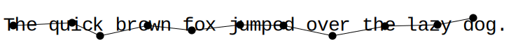
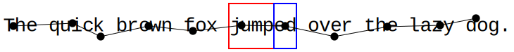
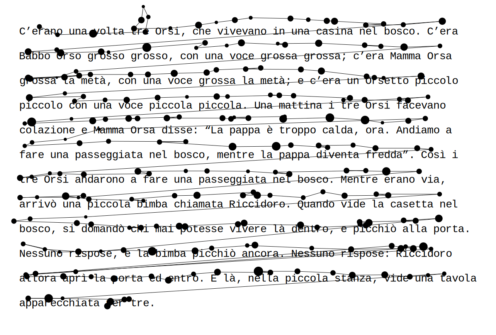
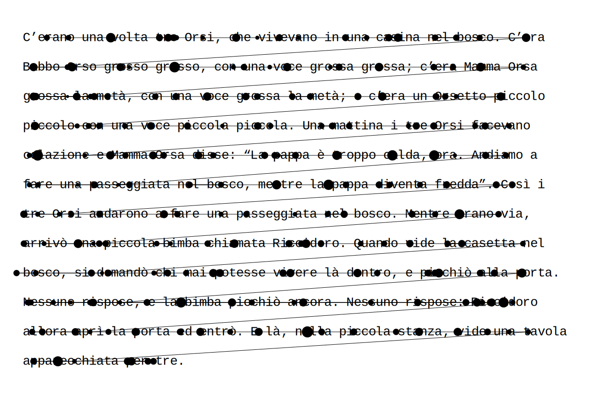

Eyekit
======

Eyekit is a Python package for handling and visualizing eyetracking data, with a particular emphasis on the reading of sentences and multiline passages presented in a fixed-width font.


Installation
------------

Eyekit is not currently listed in PyPI, but the latest version can be installed directly from this GitHub repo using `pip`:

```
pip install https://github.com/jwcarr/eyekit/archive/master.tar.gz
```

Quick Start Tutorial
--------------------

Once installed, import Eyekit in the normal way:

```python
import eyekit
```

Eyekit makes use of two core types of object: the `Text` object and the `FixationSequence` object. Much of Eyekit's functionality involves bringing these two objects into contact; typically, we have a passage of text and we want to analyze which parts of the text a participant is looking at.

### The `Text` object

A `Text` object can represent a word, sentence, or passage of text. When you create a `Text` object, it is necessary to specify the pixel position of the first character, the pixel spacing between characters, the pixel spacing between lines, and the fontsize. Since Eyekit assumes a fixed-width font, it uses these details to establish the position of every character. Let's begin by creating a single sentence `Text` object:

```python
>>> sentence = 'The quick brown fox [jump]{stem_1}[ed]{suffix_1} over the lazy dog.'
>>> txt = eyekit.Text(sentence, first_character_position=(100, 540), character_spacing=16, line_spacing=64, fontsize=28)
>>> print(txt)
### Text[The quick brown ...]
```

Often we are only interested in certain parts of the sentence, or so-called "interest areas." Eyekit has a simple markup scheme for marking up interest areas, as you can see in the above sentence. Square brackets are used to mark the interest area itself (in this case *jump* and *ed*) and curly braces are used to provide a unique label for each interest area (in this case `stem_1` and `suffix_1`). We can iterate over them using the `interest_areas()` iterator method:

```python
>>> for interest_area in txt.interest_areas():
>>>     print(interest_area.label, interest_area.text, interest_area.bounding_box)
### stem_1 jump (412, 508, 64, 64)
### suffix_1 ed (476, 508, 32, 64)
```

In this case, we are printing each interest area's label, its textual representation, and its bounding box (x, y, width, and height). Various other methods are available for treating all words, characters, or ngrams as interest areas. If, for example, you wanted to treat each word as an interest area, you could do the following without needing to explicitly mark up every word as an interest area:

```python
>>> for word in txt.words():
>>>     print(word.label, word.text, word.bounding_box)
### word_0 The (92, 508, 48, 64)
### word_1 quick (156, 508, 80, 64)
### word_2 brown (252, 508, 80, 64)
### word_3 fox (348, 508, 48, 64)
### word_4 jumped (412, 508, 96, 64)
### word_5 over (524, 508, 64, 64)
### word_6 the (604, 508, 48, 64)
### word_7 lazy (668, 508, 64, 64)
### word_8 dog (748, 508, 48, 64)
```

### The `FixationSequence` object

Fixation data is represented in a `FixationSequence` object. Let's create some fake data to play around with:

```python
>>> seq = eyekit.FixationSequence([[106, 540, 100], [190, 536, 100], [230, 555, 100], [298, 540, 100], [361, 547, 100], [430, 539, 100], [492, 540, 100], [562, 555, 100], [637, 541, 100], [712, 539, 100], [763, 529, 100]])
```

Each fixation is represented by three numbers: its x-coordinate, its y-coordinate, and its duration (in this example, they're all 100ms). Once created, a `FixationSequence` can be traversed, indexed, and sliced as you'd expect. For example,

```python
>>> print(seq[5:10])
### FixationSequence[Fixation[430,539], ..., Fixation[712,539]]
```

slices out fixations 5 through 9 into a new `FixationSequence` object.

### Bringing a `FixationSequence` into contact with a `Text`

A basic question we might have is: Do any of these fixations fall inside my interest areas? We can write some simple code to answer this:

```python
>>> for i, fixation in enumerate(seq):
>>>     interest_area = txt.which_interest_area(fixation)
>>>     if interest_area is not None:
>>>         print('Fixation {} was in interest area {}, which is "{}"'.format(i, interest_area.label, interest_area.text))
### Fixation 5 was in interest area stem_1, which is "jump"
### Fixation 6 was in interest area suffix_1, which is "ed"
```

Similarly, we might want to calculate the total time spent inside an interest area (i.e. the sum duration of all fixations in an interest area). This can be accomplished like so:

```python
>>> from collections import defaultdict
>>> results = defaultdict(int)
>>> for i, fixation in enumerate(seq):
>>>     interest_area = txt.which_interest_area(fixation)
>>>     if interest_area is not None:
>>>         results[interest_area.label] += fixation.duration
>>> print(results['stem_1'])
### 100
>>> print(results['suffix_1'])
### 100
```

Each interest area was only fixated once in this example, so the total duration on each was 100ms.

At the moment, Eyekit does not provide any built-in recipes for calculating typical measures of interest; in general, you are expected to write code to calculate whatever it is you are interested in measuring.

### Visualization

Eyekit has some basic tools to help you create visualizations of your data. We begin by creating an `Image` object, specifying the pixel dimensions of the screen:

```python
>>> img = eyekit.Image(1920, 1080)
```

Next we render our text and fixations:

```python
>>> img.render_text(txt)
>>> img.render_fixations(seq)
```

And finally, we save the image (Eyekit supports SVG, PDF, EPS, and PNG):

```python
>>> img.save('quick_brown.pdf')
```


Sometimes it's useful to see the text in the context of the entire screen; other times, we'd like to remove all that excess white space and focus on the text. To do this, you can call the `crop_to_text()` method prior to saving, optionally specifying some amount of margin:

```python
>>> img.crop_to_text(margin=5)
>>> img.save('quick_brown_cropped.pdf')
```


There are many other options for creating custom visualizations of your data. For example, if we wanted to depict the bounding boxes around our two interest areas, we might do this:

```python
>>> img = eyekit.Image(1920, 1080)
>>> img.render_text(txt)
>>> for interest_area in txt.interest_areas():
>>>     if interest_area.label.startswith('stem'):
>>>         img.draw_rectangle(interest_area.bounding_box, color='red')
>>>     elif interest_area.label.startswith('suffix'):
>>>         img.draw_rectangle(interest_area.bounding_box, color='blue')
>>> img.render_fixations(seq)
>>> img.save('quick_brown_with_IAs.pdf')
```


### Multiline passages

Handling multiline passages works in largely the same way as described above. To see an example, we'll first load in some multiline passage data that is included in this repo:

```python
>>> example_data = eyekit.io.read('example_data.json')
>>> example_texts = eyekit.io.load_texts('example_texts.json')
```

and in particular we'll extract the fixation sequence for trial 0 and its associated text:

```python
>>> seq = example_data['trial_0']['fixations']
>>> txt = example_texts[example_data['trial_0']['passage_id']]
```

As before, we can plot the fixation sequence over the passage of text to see what the data looks like:

```python
>>> img = eyekit.Image(1920, 1080)
>>> img.render_text(txt)
>>> img.render_fixations(seq)
>>> img.crop_to_text(margin=50)
>>> img.save('multiline_passage.pdf')
```


A common issue with multiline passage reading is that fixations on one line may appear closer to another line due to imperfect eyetracker calibration. For example, the fixation on "passeggiata" in the middle of the text is actually closer to "Mamma" on the line above. Obviously, such "vertical drift" can cause issues in your analysis, so it may be useful to first clean up the data by snapping every fixation to its appropriate line. Eyekit implements several vertical drift correction algorithms, which can be applied using the `correct_vertical_drift()` function from the `tools` module:

```python
>>> corrected_seq = eyekit.tools.correct_vertical_drift(seq, txt, method='warp')
```

The default method is `warp`, but you can also use `attach`, `chain`, `cluster`, `merge`, `regress`, `segment`, and `split`. For a full description and evaluation of these methods, see [Carr et al. (2020)](https://osf.io/jg3nc/). Vertical drift correction only affects the y-coordinate of each fixation; the x-coordinate is always left unchanged. Let's have a look at the corrected fixation sequence:

```python
>>> img = eyekit.Image(1920, 1080)
>>> img.render_text(txt)
>>> img.render_fixations(corrected_seq)
>>> img.crop_to_text(50)
>>> img.save('multiline_passage_corrected.pdf')
```



### Input–output

Eyekit is not especially committed to any particular file format; so long as you have an x-coordinate, a y-coordinate, and a duration for each fixation, you are free to store data in whatever format you choose. However, as we have seen above, Eyekit provides built-in support for a JSON-based format, where a typical data file looks like this:

```json
{
  "trial_0" : {
    "participant_id": "John",
    "passage_id": "passage_a",
    "fixations": [[412, 142, 131], [459, 163, 112], [551, 160, 334], ..., [588, 866, 224]]
  },
  "trial_1" : {
    "participant_id": "Mary",
    "passage_id": "passage_b",
    "fixations": [[368, 146, 191], [431, 154, 246], [512, 150, 192], ..., [725, 681, 930]]
  },
  "trial_2" : {
    "participant_id": "Jack",
    "passage_id": "passage_c",
    "fixations": [[374, 147, 277], [495, 151, 277], [542, 155, 138], ..., [1288, 804, 141]]
  }
}
```

This format is open, human-readable, and fairly flexible. Each trial object should contain a key called `fixations` that maps to an array containing x, y, and duration for each fixation. Aside from this, you can freely add other key–value pairs (e.g., participant IDs, trial IDs, timestamps, etc.). These data files can be loaded using the `read()` function from the `io` module:

```python
>>> data = eyekit.io.read('example_data.json')
```

and written using the `write()` function:

```python
>>> eyekit.io.write(data, 'example_data.json', indent=2)
```

Optionally, the `indent` parameter specifies how much indentation to use in the files – indentation results in larger files, but they are more human-readable.

If you store your fixation data in CSV files, you can load the data into a FixationSequence by doing something along these lines (assuming you have columns `x`, `y`, and `duration`):

```python
>>> import pandas
>>> data = pandas.read_csv('mydata.csv')
>>> seq = eyekit.FixationSequence([fxn for fxn in zip(data['x'], data['y'], data['duration'])])
```

Eyekit also has rudimentary support for importing data from ASC files. When importing data this way, you must specify the name of a trial variable and its possible values so that the importer can determine when a new trial begins:

```python
data = eyekit.io.import_asc('mydata.asc', 'trial_type', ['Experimental'], extract_variables=['passage_id', 'response'])
```

In this case, when parsing the ASC file, the importer would consider

```
MSG 4244100 !V TRIAL_VAR trial_type Experimental
```

to mark the beginning of a new trial and will extract all `EFIX` lines that occur within the subsequent `START`–`END` block. Optionally, you can specify other variables that you want to extract (in this case `passage_id` and `response`), resulting in imported data that looks like this:

```python
{
  "trial_0" : {
    "trial_type" : "Experimental",
    "passage_id" : "passage_a",
    "response" : "yes",
    "fixations" : FixationSequence[[368, 161, 208], ..., [562, 924, 115]]
  }
}
```

In addition, rather than load one ASC file at a time, you can also point to a directory of ASC files, all of which will then be loaded into a single dataset:

```python
data = eyekit.io.import_asc('asc_data_files/', 'trial_type', ['Experimental'], extract_variables=['passage_id', 'response'])
```


Documentation
-------------

### CLASS `eyekit.FixationSequence(sequence)`

#### Arguments:

- **sequence** *list* of *tuple* of *int* or something similar that conforms to the following structure: [[(106, 540, 100), (190, 536, 100), (230, 555, 100), ..., (763, 529, 100)], where each tuple contains the X-coordinate, Y-coordinate, and duration of a fixation

#### Methods:

- FixationSequence.**\_\_len\_\_** Returns length of the fixation sequence
- FixationSequence.**\_\_getitem\_\_** Returns the `Fixation` at the given index or a `FixationSequence` if the index is a slice.
- FixationSequence.**\_\_iter\_\_** Yields each `Fixation` object in the fixation sequence
- FixationSequence.**\_\_add\_\_** Returns the concatenation of the fixation sequence with another fixation sequence
- FixationSequence.**append(fixation)** Appends a fixation to the end of the fixation sequence
- FixationSequence.**iter_with_discards()** Iterates over the fixation sequence including any discarded fixations
- FixationSequence.**iter_without_discards()** Iterates over the fixation sequence without any discarded fixations
- FixationSequence.**copy()** Returns copy of the fixation sequence
- FixationSequence.**tolist()** Converts the fixation sequence to a list representation
- FixationSequence.**XYarray()** Returns a Numpy array containing the XY-coordinates of the fixations
- FixationSequence.**Xarray()** Returns a Numpy array containing the X-coordinates of the fixations 
- FixationSequence.**Yarray()** Returns a Numpy array containing the Y-coordinates of the fixations 

#### Child objects:

##### `Fixation`

- Fixation.**x** *int* X-coordinate of the fixation
- Fixation.**y** *int* Y-coordinate of the fixation
- Fixation.**xy** *tuple* XY-coordinates of the fixation
- Fixation.**duration** *int* Duration of the fixation
- Fixation.**discarded** *bool* True if fixation has been discarded
- Fixation.**copy()** Returns copy of the fixation
- Fixation.**totuple()** Returns tuple representation of the fixation

### CLASS `eyekit.Text(text, first_character_position, character_spacing, line_spacing, fontsize)`

#### Arguments:

- **text** *str* (single line) or *list* of *str* (multiline) representing the text
- **first_character_position** *tuple* providing the XY-coordinates of the center of the first character in the text
- **character_spacing** *int* Pixel distance between characters
- **line_spacing** *int* Pixel distance between lines
- **fontsize** *int* Fontsize (this only affects how images are rendered and is not used in any internal calculations)

#### Properties:

- Text.**first_character_position** *tuple* XY-coordinates of the center of the first character in the text
- Text.**character_spacing** *int* Pixel distance between characters
- Text.**line_spacing** *int* Pixel distance between lines
- Text.**fontsize** *int* Fontsize
- Text.**n_rows** *int* Number of rows in the text (i.e. the number of lines)
- Text.**n_cols** *int* Number of columns in the text (i.e. the number of characters in the widest line)
- Text.**line_positions** *int* Y-coordinates of the center of each line of text
- Text.**word_centers** *int* XY-coordinates of the center of each word

#### Methods:

- Text.**\_\iter\_\_** Yields each character in the text
- Text.**\_\_getitem\_\_** Returns the indexed character(s) as an `InterestArea`
- Text.**lines()** Yields each line in the text as an `InterestArea` object
- Text.**which_line(fixation)** Returns the line `InterestArea` that `fixation` falls inside
- Text.**words()** Yields each word in the text as an `InterestArea` object
- Text.**which_word(fixation)** Returns the word `InterestArea` that `fixation` falls inside
- Text.**characters(include_non_word_characters=False)** Yields each character in the text as an `InterestArea` object
- Text.**which_character(fixation, include_non_word_characters=False)** Returns the character `InterestArea` that `fixation` falls inside
- Text.**ngrams(n)** Yields each character ngram, for given n, as an `InterestArea` object
- Text.**interest_areas()** Yields each `InterestArea` object that was parsed from the raw text
- Text.**which_interest_area(fixation)** Returns the parsed `InterestArea` that `fixation` falls inside
- Text.**get_interest_area(label)** Returns the parsed `InterestArea` for a given label
- Text.**rc_to_xy(rc, rc2=None)** Converts a row,column index to XY-coordinates
- Text.**xy_to_rc(xy, xy2=None)** Converts XY-coordinates to a row,column index
- Text.**in_bounds(fixation, threshold)** Returns `True` if `fixation` is within `threshold` of any character in the text

#### Child objects:

##### `Character`

- Character.**x** *int* X-coordinate of center of character
- Character.**y** *int* X-coordinate of center of character
- Character.**xy** *tuple* XY-coordinates of center of character
- Character.**r** *int* Row index of character
- Character.**c** *int* Column index of character
- Character.**rc** *tuple* Row-column index of character
- Character.**non_word_character** *bool* True if character is non-alphabetical

##### `InterestArea`

- InterestArea.**label** *str* Arbitrary label
- InterestArea.**text** *str* String representation
- InterestArea.**chars** *list* Sequence of Character objects
- InterestArea.**bounding_box** *tuple* X, Y, width, and height of IA bounding box
- InterestArea.**width** *int* width of bounding box
- InterestArea.**height** *int* height of bounding box
- InterestArea.**x_tl** *int* X-coordinate of top-left corner of bounding box
- InterestArea.**y_tl** *int* Y-coordinate of top-left corner of bounding box
- InterestArea.**x_br** *int* X-coordinate of bottom-right corner of bounding box
- InterestArea.**y_br** *int* Y-coordinate of bottom-right corner of bounding box
- InterestArea.**center** *tuple* XY-coordinates of center of bounding box
- InterestArea.**\_\_iter\_\_** Yields each `Character` object in the interest area
- InterestArea.**\_\_getitem\_\_** Returns the `Character` at the given index
- InterestArea.**\_\_contains\_\_** Returns `True` if the given fixation is inside the bounding box of the interest area (i.e., `fixation in interest_area` returns `True` if `fixation.xy` is inside `interest_area.bounding_box`).

### CLASS `eyekit.Image(screen_width, screen_height)`

#### Arguments:

- **screen_width** *int* Width of the screen in pixels
- **screen_height** *int* Height of the screen in pixels

#### Properties:

- Image.**screen_width** *int* Width of the screen in pixels
- Image.**screen_height** *int* Height of the screen in pixels

#### Methods:

- Image.**render_text(text, color='black')**
- Image.**render_fixations(fixation_sequence, connect_fixations=True, color='black', discard_color='gray', number_fixations=False, include_discards=False)**
- Image.**render_fixation_comparison(reference_sequence, fixation_sequence, color_match='black', color_mismatch='red')**
- Image.**render_heatmap(text, distribution, n=1, color='red')**
- Image.**draw_line(start_xy, end_xy, color='black', dashed=False)**
- Image.**draw_circle(xy, radius=10, color='black')**
- Image.**draw_rectangle(x, y=None, width=None, height=None, color='black', dashed=False)**
- Image.**draw_text(x, y, text, color='black', align='left', css_style={})**
- Image.**crop_to_text(margin=0)**
- Image.**set_label(label)**
- Image.**save(output_path, image_width=200)**

### MODULE `eyekit.image`

#### `eyekit.image.combine_images()`

Combine image objects together into one larger image

### MODULE `eyekit.io`

#### `eyekit.io.read(path)`

Read in data from a Eyekit JSON file

#### `eyekit.io.write(dataset, path)`

Write out some data to a Eyekit JSON file

#### `eyekit.io.load_texts()`

Load in texts from a JSON file

#### `eyekit.io.import_asc(path)`

Import an ASC file or a directory of ASC files

### MODULE `eyekit.tools`

#### `eyekit.tools.correct_vertical_drift(fixation_sequence, text, method='warp')`

Correct vertical drift. The following methods are available: `attach`, `chain`, `cluster`, `merge`, `regress`, `segment`, `split`, and `warp`. For a full description and evaluation of these methods, see [Carr et al. (2020)](https://osf.io/jg3nc/). Vertical drift correction only affects the y-coordinate of each fixation; the x-coordinate is always left unchanged.

#### `eyekit.tools.discard_out_of_bounds_fixations(fixation_sequence, text, in_bounds_threshold=128)`

Given a fixation sequence and text, discard all fixations that do not fall within some threshold of any character in the text.

#### `eyekit.tools.fixation_sequence_distance()`

Calculate the Dynamic Time Warping distance between two fixation sequences.

#### `eyekit.tools.spread_duration_mass()`

Compute the distribution of duration mass over the entire text.


License
-------

Eyekit is licensed under the terms of the MIT License.
