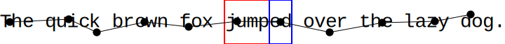
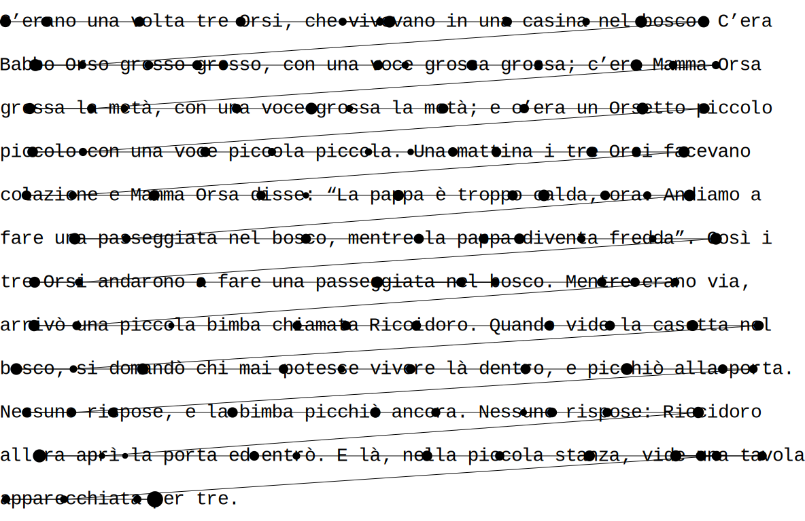
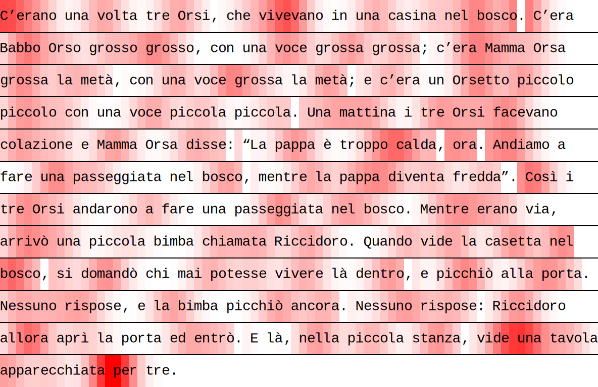

Eyekit
======

Eyekit is a Python package for handling and visualizing eyetracking data, with a particular emphasis on the reading of sentences and multiline passages presented in a fixed-width font.


Installation
------------

Eyekit is not currently listed in PyPI, but the latest verison can be installed directly from this GitHub repo using `pip`:

```
pip install https://github.com/jwcarr/eyekit/archive/master.tar.gz
```

It is pretty light-weight, with only two dependencies: Numpy and CairoSVG.

Quick Start Tutorial
--------------------

Once installed, import Eyekit into your project in the normal way:

```python
import eyekit
```

Eyekit makes use of two core types of object: the `Text` object and the `FixationSequence` object. Much of Eyekit's functionality involves bringing these two objects into contact; typically, we have a passage of text and we want to analyze which parts of the text a participant is looking at.

### The `Text` object

A `Text` object can represent a word, sentence, or passage of text. When you create a `Text` object, it is necessary to specify the pixel position of the first character, the pixel spacing between characters, the pixel spacing between lines, and the fontsize. Since Eyekit assumes a fixed-width font, it uses these details to establish the position of every character. Let's begin by creating a single sentence `Text` object:

```python
>>> sentence = 'The quick brown fox jumped over the lazy dog.'
>>> text = eyekit.Text(sentence, first_character_position=(100, 540), character_spacing=16, line_spacing=64, fontsize=28)
>>> print(text)
### Text[The quick brown ...]
```

Often we are only interested in certain parts of the sentence, or so-called "interest areas." Eyekit has a simple markup scheme for marking up interest areas:

```python
>>> sentence = 'The quick brown fox [jump]{stem_1}[ed]{suffix_1} over the lazy dog.'
>>> text = eyekit.Text(sentence, first_character_position=(100, 540), character_spacing=16, line_spacing=64, fontsize=28)
```

Square brackets are used to mark the interest area itself (in this case *jump* and *ed*) and curly braces are used to provide a unique label for each interest area (in this case `stem_1` and `suffix_1`). Now that we've specified some interest areas, we can iterate over them using the `interest_areas()` iterator method:

```python
>>> for interest_area in text.interest_areas():
>>> 	print(interest_area.label, interest_area.text, interest_area.bounding_box)
### stem_1 jump (412, 508, 64, 64)
### suffix_1 ed (476, 508, 32, 64)
```

In this case, we are printing each interest area's label, its textual representation, and its bounding box (x, y, width, and height). Various other methods are available for treating all words, characters, or ngrams as interest areas. If, for example, you wanted to treat each word as an interest area, you could do this:

```python
>>> for word in text.words():
>>> 	print(word.label, word.text, word.bounding_box)
### word_0 The (92, 508, 48, 64)
### word_1 quick (156, 508, 80, 64)
### word_2 brown (252, 508, 80, 64)
### word_3 fox (348, 508, 48, 64)
### word_4 jumped (412, 508, 96, 64)
### word_5 over (524, 508, 64, 64)
### word_6 the (604, 508, 48, 64)
### word_7 lazy (668, 508, 64, 64)
### word_8 dog (748, 508, 48, 64)
```

### The `FixationSequence` object

Eyekit is not committed to any particular file format, although there are various functions in the `io` module for reading in fixation data. In any case, once fixation data is loaded in, it is represented in a `FixationSequence` object. Let's create some fake data to play around with:

```python
>>> fixation_sequence = eyekit.FixationSequence([[106, 540, 100], [190, 536, 100], [230, 555, 100], [298, 540, 100], [361, 547, 100], [430, 539, 100], [492, 540, 100], [562, 555, 100], [637, 541, 100], [712, 539, 100], [763, 529, 100]])
```

Each fixation is represented by three numbers: its x-coordinate, its y-coordinate, and its duration (in this example, they're all 100ms). So long as you have some way of loading in these three pieces of data for each fixation, Eyekit may be a useful tool for you. Once created, a `FixationSequence` can be traversed, indexed, and sliced as you'd expect. For example,

```python
>>> print(fixation_sequence[5:10])
### FixationSequence[Fixation[430,539], ..., Fixation[712,539]]
```

slices out fixations 5 through 9 into a new `FixationSequence` object.

### Bringing a `FixationSequence` into contact with a `Text`

A basic question we might have is: Do any of these fixations fall inside my interest areas? We can write some simple code to answer this:

```python
>>> for i, fixation in enumerate(fixation_sequence):
>>> 	interest_area = text.which_interest_area(fixation)
>>> 	if interest_area is not None:
>>> 		print('Fixation {} was in interest area {}, which is "{}"'.format(i, interest_area.label, interest_area.text))
### Fixation 5 was in interest area stem_1, which is "jump"
### Fixation 6 was in interest area suffix_1, which is "ed"
```

Similarly, we might want to calculate the total time spent inside an interest area (i.e. the sum duration of all fixations in an interest area). This can be accomplished like so:

```python
>>> from collections import defaultdict
>>> results = defaultdict(int)
>>> for i, fixation in enumerate(fixation_sequence):
>>> 	interest_area = text.which_interest_area(fixation)
>>> 	if interest_area is not None:
>>> 		results[interest_area.label] += fixation.duration
>>> print(results['stem_1'])
### 100
>>> print(results['suffix_1'])
### 100
```

Each interest area was only fixated once in this example, so the total duration on each was 100ms.

### Visualization

While working with Eyekit, it is often useful to be able to see what's going on visually. Eyekit has some basic visualization tools to help you create visualizations of your data. We begin by creating an `Image` object, specifying the pixel dimensions of the screen:

```python
>>> image = eyekit.Image(1920, 1080)
```

Next we render our text and fixations:

```python
>>> image.render_text(text)
>>> image.render_fixations(fixation_sequence)
```

And finally, we will save the image as a PDF file (you can also save as SVG, EPS, or PNG):

```python
>>> image.save('quick_brown.pdf')
```


We might also want to depict the bounding boxes around each interest area. This can be accomplished like so, using red for stems and blue for suffixes:

```python
>>> image = eyekit.Image(1920, 1080)
>>> image.render_text(text)
>>> for interest_area in text.interest_areas():
>>> 	if interest_area.label.startswith('stem'):
>>> 		image.draw_rectangle(interest_area.bounding_box, color='red')
>>> 	elif interest_area.label.startswith('suffix'):
>>> 		image.draw_rectangle(interest_area.bounding_box, color='blue')
>>> image.render_fixations(fixation_sequence)
>>> image.save('quick_brown_with_IAs.pdf')
```


Sometimes it's useful to see the text in the context of the entire screen; other times, we'd like to remove all that excess white space and zoom in on the sentence. To do this, you can call the crop_to_text() method prior to saving:

```python
>>> image.crop_to_text()
>>> image.save('quick_brown_with_IAs_cropped.pdf')
```



Full Documentation
------------------

### Input–output

Eyekit is not especially committed to any particular file format; so long as you have an x-coordinate, a y-coordinate, and a duration for each fixation, you are free to store data in whatever format you choose. However, Eyekit does provide built-in support for a JSON-based format, where a typical data file looks like this:

```json
{
  "trial_0" : {
    "participant_id": "John",
    "passage_id": "passage_a",
    "fixations": [[412, 142, 131], [459, 163, 112], [551, 160, 334], ..., [588, 866, 224]]
  },
  "trial_1" : {
    "participant_id": "Mary",
    "passage_id": "passage_b",
    "fixations": [[368, 146, 191], [431, 154, 246], [512, 150, 192], ..., [725, 681, 930]]
  },
  "trial_2" : {
    "participant_id": "Jack",
    "passage_id": "passage_c",
    "fixations": [[374, 147, 277], [495, 151, 277], [542, 155, 138], ..., [1288, 804, 141]]
  }
}
```

This format is open, human-readable, and fairly flexible. Each trial object should contain a key called `fixations` that maps to an array containing x, y, and duration for each fixation. Aside from this, you can freely add other key–value pairs (e.g., participant IDs, trial IDs, timestamps, etc.). These data files can be loaded using the `read()` function from the `io` module:

```python
>>> data = eyekit.io.read('example_data.json')
```

and written using the `write()` function:

```python
eyekit.io.write(data, 'example_data.json', indent=2)
```

Optionally, the `indent` parameter specifies how much indentation to use in the files – indentation results in larger files, but they are more human-readable.

Eyekit also has rudimentary support for importing data from an ASC file. When importing data this way, you must specify the name of a trial variable and its possible values so that the importer can determine when a new trial begins:

```python
data = eyekit.io.import_asc('example_data.asc', 'trial_type', ['Experimental'], extract_variables=['passage_id', 'response'])
```

In this case, when parsing the ASC file, the importer would consider

```
MSG	4244100 !V TRIAL_VAR trial_type Experimental
```

to mark the beginning of a new trial. Optionally, you can specify other variables that you want to extract (in this case `passage_id` and `response`), resulting in imported data that looks like this:

```python
{
  "trial_0" : {
    "trial_type" : "Experimental",
    "passage_id" : "passage_a",
    "response" : "yes",
    "fixations" : FixationSequence[[368, 161, 208], ..., [562, 924, 115]]
  }
}
```

Rather than load a single ASC file, you can also pass the path to a directory of ASC files, all of which will then be loaded into a single dataset:

```python
data = eyekit.io.import_asc('asc_data_files/', 'trial_type', ['Experimental'], extract_variables=['passage_id', 'response'])
```

### Analysis tools

Eyekit provides a number of tools for handling and analyzing eyetracking data.

#### Correcting vertical drift

As can be seen in visualization above, the raw data suffers from vertical drift – the fixations gradually become misaligned with the lines of text. The `correct_vertical_drift` function can be used to snap the fixations to the text lines:

```python
eyekit.tools.correct_vertical_drift(fixation_sequence, text)
```

We can then visually inspect the corrected fixation sequence in a new image:

```python
image2 = eyekit.Image(1920, 1080)
image2.render_text(text, fontsize=28)
image2.render_fixations(fixation_sequence)
image2.save('example_images/corrected_fixations.svg')
```



#### Analyzing duration mass

On each fixation, the reader takes in information from several characters. We can visualize this by spreading the fixation data across the text using the `spread_duration_mass` function:

```python
duration_mass = eyekit.tools.spread_duration_mass(text, fixation_sequence)

image3 = eyekit.Image(1920, 1080)
image3.render_heatmap(text, duration_mass)
image3.render_text(text, fontsize=28)
image3.save('example_images/duration_mass.svg')
```



### Miscellaneous

Depending on the language you're working with and your particular assumptions, you may want to specify an alternative alphabet or how special characters should be treated. Any character in the text that is not specified in the alphabet will be ignored (for example, when iterating over characters in the text). Setting the special characters allows you to specifiy that certain characters should be treated as identical (for example, that à is the same as a or that an apostrophe is the same as a space).

```python
eyekit.set_case_sensitive(False)
eyekit.set_alphabet(['a', 'b', 'c', 'd', 'e', 'f', 'g', 'h', 'i', 'j', 'k', 'l', 'm', 'n', 'o', 'p', 'q', 'r', 's', 't', 'u', 'v', 'w', 'x', 'y', 'z', 'à', 'á', 'è', 'é', 'ì', 'í', 'ò', 'ó', 'ù', 'ú', ' ', '’'])
eyekit.set_special_characters({'à':'a', 'á':'a', 'è':'e', 'é':'e', 'ì':'i', 'í':'i', 'ò':'o', 'ó':'o', 'ù':'u', 'ú':'u', ' ':'_', '’':'_'})
```


License
-------

Eyekit is licensed under the terms of the MIT License.
