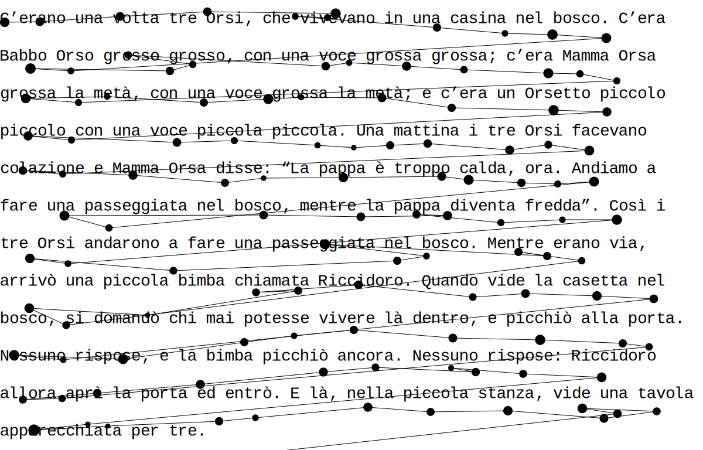

eyekit
======

Eyekit is a lite Python package for handling and visualizing eyetracking data, with a particular emphasis on the reading of multiline passages presented in a fixed-width font.


Dependencies
------------

- Python 3
- Numpy
- Inkscape (optional; required for producing .pdf, .eps, or .png graphics)


Installation
------------

```
pip install https://github.com/jwcarr/eyekit/archive/master.tar.gz
```


Usage examples
--------------

Start by importing eyekit:

```python
import eyekit
```

Eyekit makes use of two basic types of object: the `Passage` object and the `FixationSequence` object. Much of eyekit's functionality centers around bringing these two objects into contact; typically, we have a passage of text and we want to analyze which parts of the passage the participant is looking at.


### The `Passage` object

A `Passage` object represents the passage of text. It can be created by referencing a .txt file or by passing in a list of strings (one string for each line of text). It is also necessary to specify the fontsize, the pixel position of the first character, the pixel spacing between characters, and the pixel spacing between lines.

```python
passage = eyekit.Passage('example_passage.txt',
	fontsize=28,
	first_character_position=(368, 155),
	character_spacing=16,
	line_spacing=64
)
```

By assuming a fixed-width font, eyekit places the passage of text on an imaginary grid, such that each character has a row and column index. Subsetting the passage with a row,column index, for example,

```python
print(passage[0,0])
```

prints the first character on the first row along with its pixel coordinates:

```python
('C', (368, 155))
```

The `Passage` object has three iterators: `iter_words()`, `iter_chars()`, and `iter_ngrams()`. Each of these can optionally accept a filtering function, for example,

```python
for word in passage.iter_words(lambda word : len(word) == 5 and word[0] == 'b'):
	print(word, word[0].xy, word[-1].xy)
```

Here we print all five letter words beginning with 'b', along with the pixel coordinates of the first and last letters.

```python
[b, o, s, c, o] (1312, 155) (1376, 155)
[b, o, s, c, o] (768, 475) (832, 475)
[b, o, s, c, o] (1088, 539) (1152, 539)
[b, i, m, b, a] (672, 603) (736, 603)
[b, i, m, b, a] (720, 731) (784, 731)
```


### The `FixationSequence` object

Raw fixation data can be stored in whatever format you want, but when you load in your data you will represent it as a `FixationSequence`. Creation of a `FixationSequence` expects an x-coordinate, y-coordinate, and duration for each of the fixations, for example `[[368, 161, 208], [427, 159, 178], ...]`. Here we will load in the raw data from a json file:

```python
import json
with open('example_data.json') as file:
	data = json.load(file)
fixation_sequence = eyekit.FixationSequence(data['fixations'])
```

A `FixationSequence` is, as you'd expect, a sequence of fixations and it can be traversed, indexed, and sliced as expected. For example,

```python
print(fixation_sequence[10:15])
```

slices out fixations 10 through 14 into a new `FixationSequence`:

```python
FixationSequence[Fixation[1394,187], ..., Fixation[688,232]]
```


### Bringing a `FixationSequence` into contact with a `Passage`

The `Passage` object provides three methods for finding the nearest character, word, or ngram to a given fixation: nearest_word(), nearest_char(), and nearest_ngram(). For example, to retrieve the nearest word to each of the fixations in the sequence, you could do:

```python
for fixation in fixation_sequence:
	print(passage.nearest_word(fixation))
```


### The `Diagram` object

The `Diagram` object is used to create visualizations of a passage and associate fixation data. When creating a `Diagram`, you pass in the `Passage` object and the width/height of the screen. You can then chose to render the text itself and/or some associated fixation sequence.

```python
diagram1 = eyekit.Diagram(passage, width=1920, height=1080)
diagram1.render_passage()
diagram1.render_fixations(fixation_sequence)
```

The diagram can be saved to an .svg file. If you have Inkscape installed, you can also save as a .pdf, .eps, or .png file. The `crop_to_passage` option removes any margins around the passage.

```python
diagram1.save('example_diagrams/fixations.svg', crop_to_passage=True)
```



Here we can see that the raw data has an issue with vertical drift – the fixations gradually become misaligned with the lines of text. We can correct for this by snapping the fixations to the lines of the passage by using the `snap_fixation_sequence_to_lines` method of the `Passage` object:

```python
corrected_fixation_sequence = passage.snap_fixation_sequence_to_lines(fixation_sequence)

diagram2 = eyekit.Diagram(passage, width=1920, height=1080)
diagram2.render_passage()
diagram2.render_fixations(corrected_fixation_sequence)
diagram2.save('example_diagrams/corrected_fixations.svg', crop_to_passage=True)
```


On each fixation, the reader takes in information from several characters. We can visualize this by smoothing out the fixation data across the passage using the `sum_duration_mass` method of the `Passage` object:

```python
sum_duration_mass = passage.sum_duration_mass(corrected_fixation_sequence, n=1)

diagram3 = eyekit.Diagram(passage, width=1920, height=1080)
diagram3.render_heatmap(sum_duration_mass, n=1)
diagram3.render_passage()
diagram3.save('example_diagrams/sum_duration_mass.svg', crop_to_passage=True)
```


### Miscellaneous

Depending on the language you're working with and your particular assumptions, you may want to specify an alternative alphabet or how special characters should be treated. Any character in the passage that is not specified in the alphabet will be ignored (for example, when iterating over characters in the passage). Setting the special characters allows you to specifiy that certain characters should be treated as identical (for example, that à is the same as a or that an apostrophe is the same as a space).

```python
eyekit.set_case_sensitive(False)
eyekit.set_alphabet(['a', 'b', 'c', 'd', 'e', 'f', 'g', 'h', 'i', 'j', 'k', 'l', 'm', 'n', 'o', 'p', 'q', 'r', 's', 't', 'u', 'v', 'w', 'x', 'y', 'z', 'à', 'á', 'è', 'é', 'ì', 'í', 'ò', 'ó', 'ù', 'ú', ' ', '’'])
eyekit.set_special_characters({'à':'a', 'á':'a', 'è':'e', 'é':'e', 'ì':'i', 'í':'i', 'ò':'o', 'ó':'o', 'ù':'u', 'ú':'u', ' ':'_', '’':'_'})
```


License
-------

eyekit is licensed under the terms of the MIT License.
