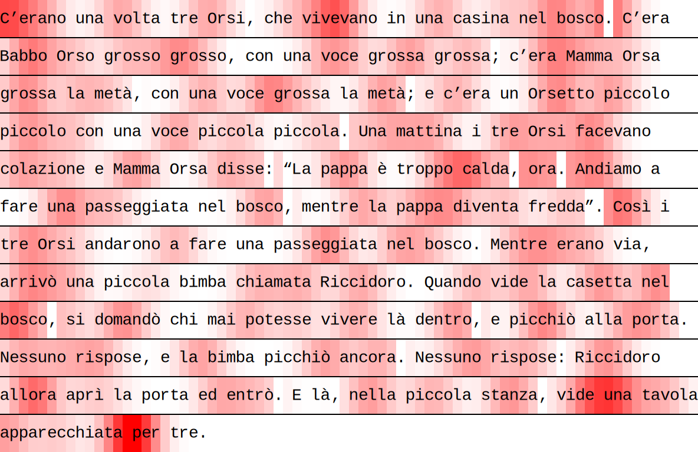

eyekit
======

A lite Python package for handling and visualizing eyetracking data


Dependencies
------------

- Python 3
- Numpy
- Inkscape (optional; required for producing .pdf, .eps, or .png graphics)


Usage examples
--------------

```python
import eyekit

eyekit.set_alphabet(['a', 'b', 'c', 'd', 'e', 'f', 'g', 'h', 'i', 'j', 'k', 'l', 'm', 'n', 'o', 'p', 'q', 'r', 's', 't', 'u', 'v', 'w', 'x', 'y', 'z', 'à', 'á', 'è', 'é', 'ì', 'í', 'ò', 'ó', 'ù', 'ú', ' ', '’'])
eyekit.set_special_characters({'à':'a', 'á':'a', 'è':'e', 'é':'e', 'ì':'i', 'í':'i', 'ò':'o', 'ó':'o', 'ù':'u', 'ú':'u', ' ':'_', '’':'_'})
```

Create a `Passage` object to represent the passage of text. This can be achieved by referencing a .txt file or by passing in a list of strings (one string for each line of text). It is also necessary to specify the fontsize, the pixel position of the first character, the pixel spacing between characters, and the pixel spacing between lines. Note that eyekit assumes a fixed-width font.

```python
passage = eyekit.Passage('example_passage.txt',
	fontsize=28,
	first_character_position=(368, 155),
	character_spacing=16,
	line_spacing=64
)
```

Load in some fixation data and create a fixation sequence. Fixation data can be stored in whatever format you want, but to create the fixation sequence, you must pass in a list containing the x-coordinate, y-coordinate, and duration of each fixation. For example, `[[368, 161, 208], [427, 159, 178], ...]`. Here we are loading in the raw data from a json file:

```python
import json
with open('example_data.json') as file:
	data = json.load(file)
fixation_sequence = eyekit.fixation_sequence(data['fixations'])
```

To render the passage and overlay the fixation sequence, we first create a `Diagram` object, passing in the `Passage` object and the width/height of the screen. We then render the passage text and fixation sequence, and finally save to an .svg file. If you have Inkscape installed, you can also save as a .pdf, .eps, or .png file. The `crop_to_passage` option removes any margins around the passage.

```python
diagram1 = eyekit.Diagram(passage, width=1920, height=1080)
diagram1.render_passage()
diagram1.render_fixations(fixation_sequence)
diagram1.save('example_diagrams/fixations.svg', crop_to_passage=True)
```


Here we can see that the raw data has an issue with vertical drift – the fixations gradually become misaligned with the lines of text. We can correct for this by snapping the fixations to the lines of the passage by using the `snap_fixation_sequence_to_lines` method of the `passage` object:

```python
corrected_fixation_sequence = passage.snap_fixation_sequence_to_lines(fixation_sequence)

diagram2 = eyekit.Diagram(passage, width=1920, height=1080)
diagram2.render_passage()
diagram2.render_fixations(corrected_fixation_sequence)
diagram2.save('example_diagrams/corrected_fixations.svg', crop_to_passage=True)
```


On each fixation, the reader takes in information from several characters. We can visualize this by smoothing out the fixation data across the passage using the `sum_duration_mass` method of the `Passage` object:

```python
sum_duration_mass = passage.sum_duration_mass(corrected_fixation_sequence, n=1)

diagram3 = eyekit.Diagram(passage, width=1920, height=1080)
diagram3.render_heatmap(sum_duration_mass, n=1)
diagram3.render_passage()
diagram3.save('example_diagrams/sum_duration_mass.svg', crop_to_passage=True)
```



Perhaps we would like to extract this sum duration mass for all five letter words in the passage:

```python
for word in passage.iter_words(length=5):
	first_char = word[0]
	row, column = first_char.rc
	print(word, sum_duration_mass[row, column:column+5])
```

```python
[e, r, a, n, o] [55.56239542 50.80633848 43.47943281 32.09920224 19.6078607 ]
[v, o, l, t, a] [35.4100847  34.03776337 25.03897217 14.70154295  8.21357986]
[b, o, s, c, o] [51.13015629 41.99530512 34.94220419 38.30359351 49.30555307]
[b, a, b, b, o] [22.36310445 37.18704518 50.21469356 54.09272477 47.47471642]
[m, a, m, m, a] [47.75696236 40.60239472 36.02602374 34.3728732  34.21157634]
[m, a, m, m, a] [24.84928646 32.90724499 33.90608541 26.95146257 16.98386291]
[d, i, s, s, e] [27.54302303 28.49634922 22.97568101 15.12084086  8.96261374]
[p, a, p, p, a] [19.66383892 31.62338871 38.62197743 36.09325964 26.31105464]
[c, a, l, d, a] [56.22971806 47.96083873 36.66431419 29.21206568 30.16163441]
[b, o, s, c, o] [14.73208584 24.37272161 32.41688592 33.19396556 25.82796889]
[p, a, p, p, a] [23.22478672 31.13068485 38.82911608 44.29209338 47.56553613]
[b, o, s, c, o] [29.86998251 23.47252909 16.4063625  10.57281211  7.08294599]
[e, r, a, n, o] [34.29650736 31.52246963 30.3799236  28.27533688 23.40551867]
[b, i, m, b, a] [2.24644614 1.53492548 1.0738736  1.64881592 4.31612295]
[b, o, s, c, o] [43.0333239  51.41569643 47.0405049  33.56961377 19.76089475]
[p, o, r, t, a] [41.43922083 39.92643815 34.31573454 24.98365556 14.64721988]
[b, i, m, b, a] [30.56931373 21.80690309 13.6095905   8.7298624   6.36324127]
[p, o, r, t, a] [7.88215105 4.7453363  2.65242948 2.68260884 5.60193617]
[e, n, t, r, ò] [33.53660925 30.30443224 27.61634655 24.11169892 18.02491451]
[n, e, l, l, a] [26.09259889 36.95080208 40.35130452 33.75998872 22.65467728]
```


License
-------

eyekit is licensed under the terms of the MIT License.
